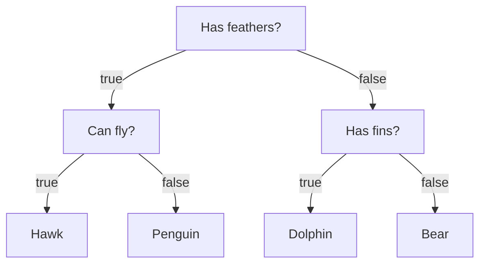
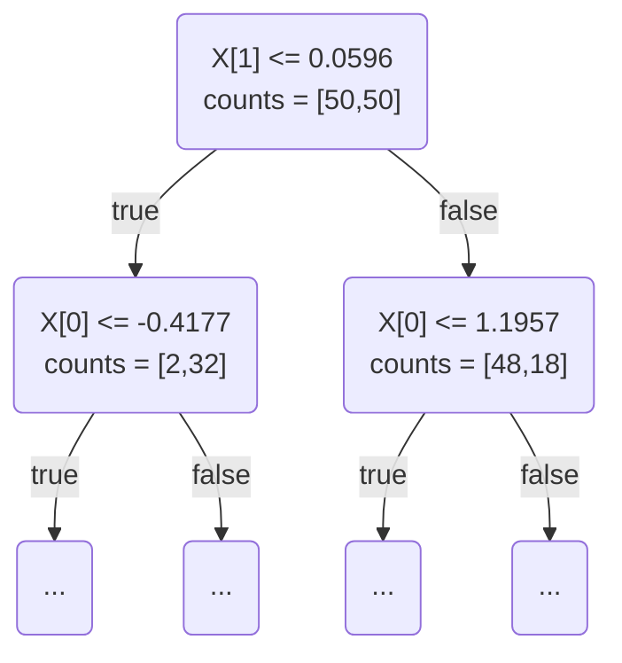
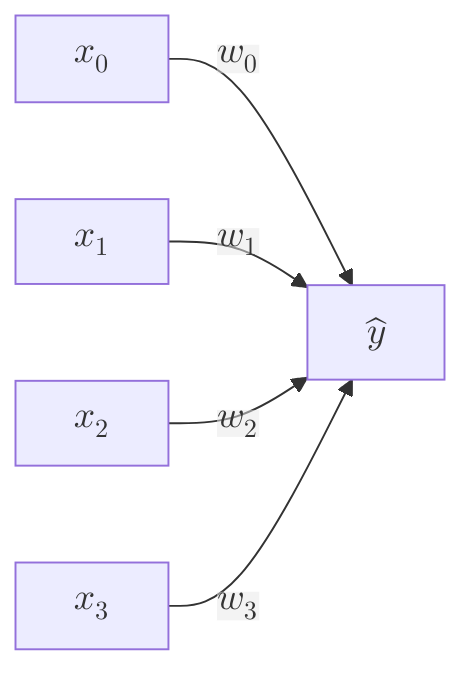
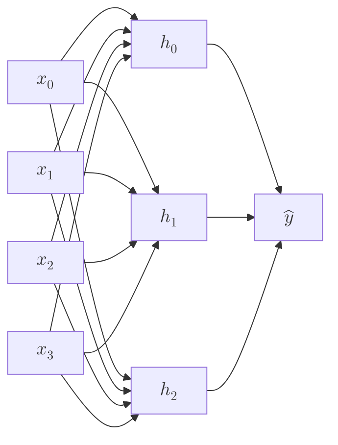

Supervised Learning can be broadly categorized into two categories

# Classification

The goal here is to predict a class label, which is a choice from a predefined list of possibilities (e.g., classifying eye irises into one of three possible species).

Classification itself can be classified into two categories

> **Binary Classification** is a special case of distinguishing between exactly two classes (e.g., classifying emails as spam or not spam).

> **Multiclass Classification** is classification between more than two classes (e.g., what language a website is built from?).

# Regression

The goal here is to predict a continuous (i.e., floating-point) number.

For example
- Predicting a person's annual income given their education, age, etc.
- The yield of a farm corn given the weather condition, previous yields, etc.

**If there is some kind of continuity in the possible outcomes, then it is likely a regression problem**.

# Overfitting, Underfitting, and Generalization

## Overfitting

Overfitting is when we train a model so that it only makes accurate predictions on the set of data that it was given (i.e., the training data). If a model is trained to be too complex/specific to the set of data it trains on, it will have a harder time making predictions on new sets of data.

## Underfitting

Underfitting is when we train a model so that it is not able to make accurate predictions on the set of data it trained with. Opposite to overfitting, the model is too simple (instead of complex) to capture the correct input/output relationships. This can be a result of a model needing more training time or input features.

## Generalization

Generalization is a model's capability to adapt and react properly to unseen/new data (i.e., how well a model can make correct predictions after training). It is the "sweet spot" between underfitting and overfitting.


We will now look at models built around supervised learning.

# K-Neighbors Classification

Building a K-Nearest-Neighbors (KNN) algorithm consists of finding the closest data points in the given dataset - its "nearest neighbors".

The simplest KNN algorithm only considers exactly one nearest neighbor. Instead of considering only the closest neighbor, we can also consider an arbitrary number ($k$) of neighbors (hence the name). When using more than one label, we use voting to assign a label (i.e., for each test point, count how many neighbors belong to class 0, 1, etc. Then assign the class that is most frequent).

```python
from sklearn.neighbors import KNeighborsRegressor  

k = 3
knn = KNeighborsRegressor(n_neighbors=k).fit(X_train, y_train)  

train_score = knn.score(X_train, y_train)
test_score = knn.score(X_test, y_test)
```

There are two important parameters to KNN:
1. The number of neighbors - in practice, using a small number of neighbors like three or five works well
2. How distance is measured between points - typically Euclidian works well

## Strengths of KNN
- Very easy to understand
- Often gives reasonable performance without a lot of adjustments

## Weaknesses of KNN
- Building the model is usually very fast, but when your training set is very large (horizontally or vertically) the prediction can be slow
- The approach often does not perform well on datasets with many features and does particularly bad with datasets with features consisting of mostly 0's

Overall, KNN is not often used in practice due to prediction being slow and its inability to handle many features.


# Linear Models

Linear models are a class of models that are widely used in practice - they make a prediction using a linear function of the input features. The general prediction formula for a linear model is

$$
\hat{y} = w_0x_0 + w_1x_1 + \cdots + w_px_p + b
$$
with $x_i$ being the features, $w_i$ and $b$ being parameters of the model that are learned, and $\hat y$ is the prediction.

There are many different linear models for regression. The difference between these models lies in how the model parameters $w$ and $b$ are learned from the training data, along with how model complexity can be controlled.

## Linear Regression

Also known as Ordinary Least Squares, and is the simplest/most classic linear method for regression. It finds $w$, $b$ that minimize the mean squared error between predictions and true regression targets $\hat y$ on the training set. The mean squared error is the sum of the squared differences between the predictions/true values. Linear regression has no parameters, but also has no way to control model complexity.

```python
from sklearn.linear_model import LinearRegression

X_train, X_test, y_train, y_test = train_test_split(X, y, random_state=42)

lr = LinearRegression().fit(X_train, y_train)

# slope parameters (w)
w = lr.coef_

# intercept (b)
b = lr.intercept_
```


## Ridge Regression

The formula Ridge uses to make predictions is the same one for ordinary least squares, except the coefficients $w$ are chosen not only so that they predict well with the data, but also to fit an additional constraint - to make the magnitude of coefficients as small as possible (i.e., all $w_i$ should be close to zero). Intuitively this should mean each feature should have as little effect on the outcome as possible.

This constraint is an example of what is called regularization - specifically **L2 Regularization**.

```python
from sklearn.linear_model import Ridge

alpha = 1
ridge = Ridge(alpha=alpha).fit(X_train, y_train)

train_score = ridge.score(X_train, y_train)
test_score = ridge.score(X_test, y_test)
```

How much importance the model places on simplicity vs training set performance can be specified by the user using the `alpha` parameter. Increasing alpha forces coefficients to move towards zero, decreasing training set performance but helping generalization. Decreasing alpha allows coefficients to be less restricted, the more you decrease it the more it behaves like [[#Linear Regression]].


## Lasso Regression

An alternative to Ridge for regularizing linear regression is Lasso. Lasso also restricts coefficients to be close to zero, but uses **L1 Regularization** instead of L2.

The consequence of L1 is that when using lasso, some coefficients are exactly zero. This means that some features are entirely ignored by the model (a concept known as **feature selection**). Having some coefficients as zero makes a model easier to interpret.

```python
from sklearn.linear_model import Lasso

alpha = 1
lasso = Lasso(alpha=alpha).fit(X_train, y_train)

train_score = lasso.score(X_train, y_train)
test_score = lasso.score(X_test, y_test)
num_features_used = np.sum(lasso.coef_ != 0)
```


# Linear Models for Classification

Different algorithms choose different ways to measure what "fitting the training set well" means. For technical mathematical reasons, it is not possible to adjust $w$ and $b$ to minimize the number of misclassifications as one might hope.

The two most common linear classification algorithms are [[#Logistic Regression and Linear SVMs]].

## Logistic Regression and Linear SVMs

Despite its name, Logistic Regression is a classification, not a regression algorithm.

```python
from sklearn.linear_model import LogisticRegression
from sklearn.svm import LinearSVC

C = 1

lrg = LogisticRegression(C=C).fit(X, y)
lrg_score = lrg.score(X, y)

lsv = LinearSVC(C=C).fit(X, y)
lsv_score = lsv.score(X, y)
```

The parameter `C` determines the strength of the regularization, known as the "trade-off parameter". When you use a high value for `C`, `LogisticRegression` and `LinearSVC` try to fit the training data as best as possible. With low values of `C`, the models put more emphasis on finding a coefficient vector $w$ that is close to zero.

Using low values of `C` will cause the algorithm to try and adjust to the majority of data points, where higher will stress the importance that each individual data point be classified correctly.

# Linear Models for Multiclass Classification

Many linear classification models are for binary classification only, and do not extend naturally to the multiclass case (with the exception of [[#Logistic Regression and Linear SVMs|Logistic Regression]]). A common technique to extend a binary to a multiclass classification algorithm is the **one-vs-rest approach**.

In the **one-vs-rest approach** a binary model is learned for each class that tries to separate that class from all other classes, resulting in as many binary models as there are classes.

```python
from sklearn.datasets import make_blobs
from sklearn.svm import LinearSVC

# X shape is (n,m)
# y shape is (n,1)
X, y = make_blobs()

svm = LinearSVC().fit(X, y)
```

## Strengths of Linear Models

The main parameter of linear models is the regularization parameter `alpha` in the regression models, and `C` in `LinearSVC` and `LogisticRegression`.

Large values of `alpha` or small values of `C` produce simpler models. Another decision to be made is if we want L1 or L2 Regularization.

Use L1 if only a few features are actually important, otherwise use L2. L1 is also useful if the interpretability of the model is important.


# Naive Bayes Classifiers

Naive Bayes (NB) Classifiers are a family of classifiers that are quite similar to linear models. They tend to be faster in training - the price paid for the efficiency is that naive Bayes models **often provide generalization performance that is slightly worse than linear classifiers like [[#Logistic Regression and Linear SVMs]]**.

There are three kinds of classifiers `scikit` provides: `GaussianNB`, `BernoulliNB`, `MultinomialNB`.

- `GaussianNB` can be applied to any continuous dataset
- `BernoulliNB` assumes a binary dataset
```python
X = np.array([[0, 1, 0, 1],
			  [1, 0, 1, 1],
			  [0, 0, 0, 1],
			  [1, 0, 1, 0]])
			  
y = np.array([0, 1, 0, 1])
```
- `MultinomialNB` assumes count data (e.g., frequency)

## Strengths of NB Models

- `MultinomialNB` and `BernoulliNB` have a single parameter `alpha` which controls model complexity
- The way `alpha` works is that the algorithm adds to the data `alpha` many virtual data points that have positive values for all the features
- This results in a "smoothing" of the statistics
- A large `alpha` means more smoothing, resulting in less complex models
- The algorithms performance is relatively robust to the setting of `alpha`, meaning that setting `alpha` is not critical for good performance (but it usually improves accuracy)
- `GaussianNB` is mostly used on very high-dimensional data, while the other two variants of NB are widely used for sparse count data such as text
- `MultinomialNB` usually performs better than `BinaryNB`, particularly on datasets with a relatively large number of non-zero features

## Weaknesses of NB Models

- The NB models share many of the [[#Strengths of Linear Models|strengths and weaknesses of linear models]]
- They are very fast to train and predict
- The models work very well with high-dimensional sparse data and are relatively robust to the parameters
- NB models are great baseline models and are often used on very large datasets (where training a linear model might take too long)


# Decision Trees

Decision Trees are widely used models for [[#Classification]] and [[#Regression]] tasks. They essentially learn a hierarchy of if/else questions that lead to a **decision**.

These questions are similar to questions you might ask in a game of 20 Questions. Imagine you would want to distinguish between animals such as bears, hawks, penguins, and dolphins.



Each node in the tree represents a question (i.e., a terminal). The leaves represent the answers to the questions. The edges connect the answers to a question with another question.

## Building Decision Trees

Consider a dataset with two half-moon shapes: each class consists of 75 data points.

To learn a decision tree means to learn the sequence of if/else questions that gets us to the true answer most quickly. These questions are called **tests** (not to be confused with a test set).

Usually data does not come in the form of binary features, but as continuous features. These tests that are used on continuous data are of the form "is feature $f_i$ larger than value $a$?"

The root node represents the entire dataset, with 75 points belonging to class 0 and 75 points belonging to class 1. The split is done by testing `x[1] <= 0.06`. 

If the test is true, a point is assigned to the left node which will contain 2 points belonging to class 0, and 32 points belonging to class 1. If the test is false, the point is assigned to the right node which will contain 48 points belonging to class 0 and 18 points belonging to class 1.

This recursive process yields a binary tree of decisions, with each node containing a test (i.e., each test can be thought of as splitting the part of the data that is currently being considered along one axis). The recursive partitioning of the data is repeated until each region in the partition only contains a single target value.

A leaf of the tree that contains data points that all share the same target value is called **pure**. A prediction on new data point is made by checking which region of the partition of feature space the point lies in, and then predicting the majority target in that region.

## Decision Trees for Regression Tasks

It is also possible to use these trees for regression tasks - with the exact same technique. The output of the data point is the mean target of the training points in this leaf.

Typically, building a tree until leaves are pure results in models that are very complex and [[#Overfitting|highly overfit]]. The presence of pure leaves means that a tree is 100% accurate on the training set.



There are two common strategies to prevent overfitting:
1. Stopping the creation of the tree early (**pre-pruning**)
2. Building the tree but then removing or collapsing nodes that contain little information (**post-pruning** or just **pruning**)

Criteria for pre-pruning involves
1. Limiting the maximum depth of the tree
2. Limiting the maximum number of leaves
3. Requiring a minimum number of points in a node to keep splitting it

```python
from sklearn.tree import DecisionTreeClassifier

max_depth = 4
tree = DecisionTreeClassifier(max_depth=max_depth)

tree.fit(X_train, y_train)

train_score = tree.score(X_train, y_train)
test_score = tree.score(X_test, y_test)
```


## Feature Importance in Trees

Instead of looking at the whole tree (which can be tasking) there are some useful properties we can derive to summarize the workings of the tree. The most common one is the feature importance, which rates how important each feature is for the decision a tree makes.

These features can be extracted using `tree.feature_importances_`.


## Strengths of Decision Trees

- A resulting model can be easily visualized and understood by non-experts (at least for smaller trees)
- The algorithms are completely invariant to the scaling of the data
	- This is because each feature is processed separately; the possible splits of data do not depend on the scale
	- This implies decision trees work well when you have features on completely different scales (or a mix of binary and continuous features)!


## Weaknesses of Decision Trees

- Even with pre-pruning, decision trees tend to overfit and provide poor generalization performance


# Ensembles

## Random Forests

A random forest is essentially just a collection of different [[#Decision Trees]]. 

The idea is that each tree will make a relatively good prediction, but will likely overfit. If we build a bunch of trees, then we can reduce the amount of overfitting by averaging results.

A random forest model takes a parameter `n_estimators` which is equal to the number of trees to be built. It takes a sample of the features, builds the trees, and looks for the best possible tests involving one of the features. This can be controlled with `max_features`.

- A high `max_features` means the trees in the forest will be more similar, and will fit data easier
- A low `max_features` means the trees in the forest will be very different, and each tree might need to be deeper to fit the data well


### Important Parameters

- `n_estimators` - number of trees in the forest
	- A common rule of thumb is "build as many as you have time/memory for"
- `max_features` - max number of features to select in bootstrapping
- `max_depth` - maximum depth of trees in the forest


### Strengths of Random Forests

- Often do not require heavy tuning of parameters
- Same benefits of decision trees

The only reason to still use a decision tree is if you need to see a direct representation of the decision-making process.

### Weaknesses of Random Forests

- Building random forests on large datasets can be time consuming
	- Parallelization can help with this (there is even a parameter for the number of cores to use `n_jobs`)
- Poor performance on high dimensional, sparse data (e.g., text data)
- Require more memory and slower to predict


## Gradient Boosted Decision Trees

This is a more powerful ensemble model. It also combines multiple decision trees to make the model, but each tree is built by correcting mistakes made in the previously built tree.

Gradient boosted trees often use very shallow trees (depth ~ 1 to 5), which makes the model smaller in memory and predictions are faster.


### Important Parameters

- `learning_rate` - controls how strongly each tree tries to correct the mistakes of the previous one
	- A higher `learning_rate` ~ stronger corrections in the model
- `n_estimators` - number of trees in the ensemble
	- As opposed to [[#Random Forests]], a higher value leads to a more complex model (overfitting)
	- Common practice is to fit `n_estimators` on time/memory budget and then search for different `learning_rates`
- `max_depth` - max depth for each tree in the forest (default is low anyways)


### Strengths of Gradient Boosted Trees

- Is scale-invariant and works with a mix of binary/continuous features

### Weaknesses of Gradient Boosted Trees

- Requires careful tuning of parameters
- Training time is long
- Does not work well with high-dimensional, sparse data (just like other tree-based models)


# Kernelized Support Vector Machines

(Note we will only discuss this for classification purposes)

Kernel SVMs are an extension that allows for more complex models that are not defined linearly.

Adding nonlinear features to data can make linear models much more powerful - however often we don't know *which* features to add. There are two ways to map data into a higher-dimensional space that are commonly used in SVMs:
1. **Polynomial kernel** - computes all possible polynomials up to a certain degree of the original features (i.e., $x_{i}^2, x_{i}^3, \dots$).
2. **Radial basis function (RBF) kernel** (aka Gaussian kernel) - corresponds to an $\infty$-dimensional feature space.
   It considers all possible polynomials of all degrees, but the importance of the features decreases for higher degrees (think Taylor expansions)

Kernel SVMs learn the importance of each point to create the decision boundary between classes. Typically, only a subset of training points matter for defining the decision boundary: the ones that lie on the border between the classes (these are called **support vectors**).

Predictions are made by using the distance to each support vector and the importance of the vector learned during training. These distances are calculated with the **Gaussian Kernel**

$$
k_{\text{rbf}}(x_{1},x_{2}) = \exp(\gamma || x_{1} - x_{2}||^{2})
$$
With $\gamma$ being a constant controlling the width of the kernel (this is literally just a [[Gaussian Function|Gaussian]]).


### Important Parameters

- `Gamma` - controls the width of the Gaussian kernel, i.e., the scale of what defines points as "close"
- `C` - for regularization, similar to the linear models
	- High `C` ~ limits importance of each point


### Strengths of Kernelized SVMs

- Can make complex decision boundaries, even if the data only has a few features
- Works well on low and high-dimensional data

### Weaknesses of Kernelized SVMs

- Scale-dependent, i.e., every feature needs to be approximately the same scale
	- A common rescaling method for kernel SVMs is to scale all data between 0 and 1, for example, using `MinMaxScalar`
- Do not scale well with number of samples
	- Working with datasets ~ $10^5$ samples becomes challenging on time and memory use
- Hard to interpret/explain


# Neural Networks (Deep Learning)


## Multilayer Perceptrons

Multilayer perceptrons (MLPs), aka (vanilla) feed-forward neural networks, aka neural networks, are generalizations of linear models that perform multiple stages of processing to come to a decision.

Recall the linear regressor model $\hat{y} = w_{0}x_{0} + w_{1}x_{1} + \dots + w_{p}x_{p} + b$. This can be viewed as 



In an MLP, this process of computing the weighted sums is repeated multiple times using "hidden layers", which acts as an intermediate processing step




This model has a lot more coefficients (weights) to learn - there is one between every input and hidden unit, and one between every hidden unit and the output. 

Computing a series of weighted sums is mathematically the same as computing one weighted sum, so to make this truly more powerful than a linear model we apply a nonlinear function to the weighted sum of each hidden unit. This function is either the **rectifying nonlinearity** (`relu`) or **tangens hyperbolicus** (`tanh`).

This result of this function is used in the weighted sum to compute the output $\hat{y}$. `relu` cuts off values below zero and `tanh` saturates high and low input values to -1 and +1.


### Important Parameters of MLPs

- `activation` - either `'relu'` or `'tanh'`.
- `hidden_layer_sizes` - the number of nodes in the hidden layers and the number of hidden layers, this can be small (e.g., 10) for small/simple datasets or large (e.g., 10000) for complex datasets.
	- Start with 1 or 2 layers, expand from there if needed
	- The number of nodes per hidden layer usually is similar to the number of input features (but rarely near or above 10000)
	- Many hidden layers in a neural network is what inspired the term "deep learning"
- `algorithm` - two easy-to-use choices
	- `'adam'` works well in most situations but is quite sensitive to scaling
	- `'l-bfgs'` which is more robust but takes a longer time on larger models/datasets


# Uncertainty Estimates from Classifiers

Often we are not only interested in which class is predicted, but how certain it is that it is the right class. Imagine a medical application testing for cancer - making a false negative prediction might lead to a serious disease not being treated. 

There are two different functions in `scikit-learn` that can be used to obtain uncertainty estimates from classifiers: 
- `decision_function`
	- in the case of binary classification, this returns a float for each sample
	- this value encodes how strongly the model believes a point belongs to a class. Positive (negative) values indicate a preference for the positive (negative) class
- `predict_proba`
	- This returns two values, the first being the estimated probability of the first class and the second being for the second class


# Summary

- **Nearest neighbors**
	- Good for small datasets and a baseline
	- Easy to explain
- **Linear models**
	- Go-to as a first algorithm to try
	- Good for large and high-dimensional datasets
- **Naive Bayes**
	- Only for classification
	- Faster than linear models
	- Good for large and high-dimensional datasets
	- Less accurate than linear models
- **Decision trees**
	- Very fast
	- Don't need to scale data
	- Easily visualized/explained
- **Random forests**
	- Often performs better than decision trees
	- Not good for high-dimensional sparse data
- **Gradient boosted decision trees**
	- Often more accurate than random forests
	- Slower to train, faster to predict than random forests (and smaller in memory)
	- Requires more parameter tuning than random forests
- **Support vector machines**
	- Powerful for medium-sized datasets of features with similar meaning
	- Requires scaling
	- Sensitive to parameters
- **Neural networks**
	- Can build very complex models, particularly for large datasets
	- Requires scaling
	- Sensitive to parameters
	- Large models require long training times

