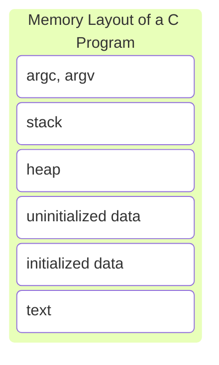

[[_Operating System Fundamentals]]

## Concept of a Process

An OS executes a variety of programs that run as a **process**. A process is defined as a program in execution. There are multiple parts of a process
- The program code, called the **text section**
- Current activity including **program counter**, processor registers
- **Stack** containing temporary data such as function parameters, local variables, etc.
- **Data section** containing global variables
- **Heap** containing memory dynamically allocated during runtime

A program (a passive entity stored on a disk as an executable file) becomes a process when it is loaded into memory.

### Process State

As a process executes, it changes state
- **New** - the process is being created
- **Running** - instructions are being executed
- **Waiting** - the process is waiting for some event to occur
- **Ready** - the process is waiting to be assigned to a processor
- **Terminated** - the process has finished execution

### Process Control Block

The **Process Control Block (PCB)** represents each process in the OS. A PCB contains many pieces of information associated with a specific process, including
- Process state
- Program counter
- CPU registers
- CPU scheduling information
- Memory-management information
- Accounting information
- I/O status information

## Process Scheduling

The **process scheduler** selects among available processes for the next execution on the CPU core. It has the goal of maximizing CPU use and quickly moving processes in/out of the CPU core.

### Context Switch

A **context switch** occurs when the CPU switches from one process to another.

When the CPU switches to another process, the system must save the state of the old process and load the saved state for the new process via a context switch.

## Operations on Processes

Systems must provide mechanisms to both create and terminate processes.

### Process Creation

Parent processes create child processes, which in turn create other processes. This creates a tree of processes. A process is identified and managed via a **process identifier (pid)**. There are multiple options for how resources can be shared
- Parent and children can share all resources
- Children can share a subset of the parent's resources
- Parent and child share no resources

There are also options for how they are executed
- Parent and child can execute concurrently
- Parent waits until the child terminates

Also for the address space
- Child can be a duplicate of the parent
- Child can have a program loaded into it

### Process Termination

Once a process executes its last statement, it asks the operating system to delete it using the `exit()` system call. This returns the status data from the child to parent (via `wait()`) and its resources are deallocated by the OS.

## Interprocess Communication

## IPC in Shared-Memory Systems

## IPC in Message-Passing Systems

## Examples of IPC Systems

## Communication in Client-Server Systems