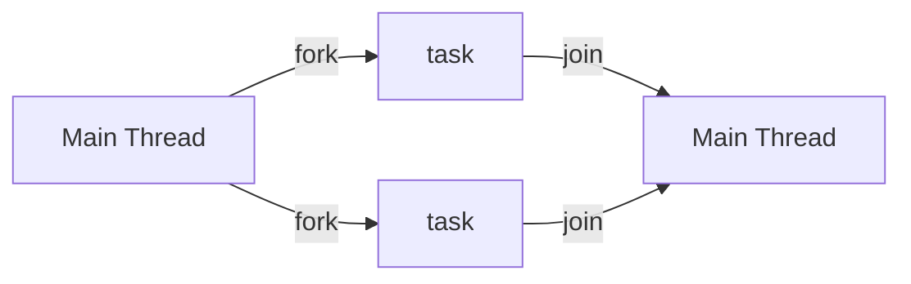

[[_Operating System Fundamentals]]

Most modern applications are multithreaded - threads run within an application so that multiple tasks can be implemented at once.

**Parallelism** implies a system can perform more than one task simultaneously, while **concurrency** supports more than one task making progress.

## Amdahl's Law

Amdahl's Law identifies performance gains from adding additional cores to an application that has both serial and parallel components.

Let $S$ be the serial portion and $N$ be the number of processing cores. Then the speed up of an application is bounded by

$$
\text{speed up} \leq \frac{1}{S+\frac{1-S}{N}}
$$
From this we can see that if an application is 75% parallel (and 25% serial), moving from 1 to 2 cores results in a speed up factor of 1.6.

As $N \rightarrow \infty$, speed up approaches $1/S$.

## Multithreading Models

### Many-to-One

The many-to-one model describes many user threads mapped to a single kernel thread. 

This results in:
- A single thread block causes all threads to block
- Multiple threads cannot run in parallel on multicore systems because only one may be in the kernel at a time

### One-to-One

The one-to-one model maps each user-level thread to a kernel thread (i.e., creating a user-level thread creates a kernel thread).

This results in more concurrency than [[#Many-to-One|many-to-one]], but the number of threads per process can be restricted from overhead.


### Many-to-Many

The many-to-many model allows many user threads to map to many kernel threads. This allows the OS to create a sufficient number of kernel threads. This is not very common.


### Two-level

This is similar to [[#Many-to-Many|many-to-many]] except it allows a user thread to be **bound** to a kernel thread.


## Thread Libraries

### Pthreads

### Windows Threads

### Java Threads

Java Threads are managed by the JVM.

They are created by either (1) extending the `Thread` class, or (2) implementing the `Runnable` interface (more standard).

```java
public interface Runnable
{
	public abstract void run();
}
```

```java
// Implementing Runnable
class Task implements Runnable
{
	public void run()
	{
		System.out.println("I am a thread");
	}
}

// Creating a thread
Thread worker = new Thread(new Task());
worker.start();

// Waiting on a thread
try
{
	worker.join();
}
catch (InterruptedException ie) { }
```

Instead of explicitly creating threads, Java also allows thread creation around the `Executor` interface

```java
public interface Executor
{
	void execute(Runnable command);
}
```

```java
Executor service = new Executor();
service.execute(new Task()); // Task implements Runnable
```

## Implicit Threading

**Implicit Threading** is the creation and management of threads done by the compilers and run-time libraries instead of the programmers.

There are five methods we will explore

### Thread Pools

**Thread Pools** involve creating a number of threads in a pool where they await work.

Advantages:
- Usually slightly faster to service a request with an existing thread than to create a new thread
- Allows the number of threads in the application to be bound to the size of the pool
- Separating task to be performed from mechanics of creating the task allows for different strategies of running tasks
	- i.e., tasks could be scheduled to run periodically

#### Windows Thread Pools

```c
DWORD WINAPI PoolFunction(AVOID Param){
 /*
  * this will run in a separate thread
  */
}
```

#### Java Thread Pools

Three factory methods exist for creating thread pools
- `static ExecutorService newSingleThreadExecutor()`
- `static ExecutorService newFixedThreadPool(int size)`
- `static ExecutorService newCachedThreadPool()`

```java
import java.util.concurrent.*;
// ----

int numTasks = 3;

// create thread pool
ExecutorService pool = Executors.newCachedThreadPool();

// run each task
for (int i = 0; i < numTasks; i++)
	pool.execute(new Task());
	
// shut down pool once all threads have completed
pool.shutdown();
```


### Fork-Join Parallelism

Multiple threads (tasks) are [[Forks||forked]] and then joined.



The general algorithm is
```pseudocode
Task(problem)
	if the problem is small enough
		solve the problem directly
	else
		subtask1 = fork(new Task(subset of problem))
		subtask2 = fork(new Task(subset of problem))
		
		result1 = join(subtask1)
		result2 = join(subtask2)
		
		return combined results
```


#### Java Fork-Join Parallelism

```java
ForkJoinPool pool = new ForkJoinPool();

// integers to be summed
int[] array = new int[SIZE];

SumTask task = new SumTask(0, SIZE - 1, array);
int sum = pool.invoke(task);
```

```java
public class SumTask extends RecursiveTask<Integer>
{
	// ----
}
```

### OpenMP

**OpenMP** is a set of compiler directives and an API for C, C++ and FORTRAN. It provides support for parallel programming in shared-memory environments. Its main task is **identifying parallel regions** - blocks of code that can run in parallel.

```c
#include <omp.h>
#include <stdio.h>

int main()
{
	// sequential code
	
	#pragma omp parallel
	{
		printf("I am a parallel region");
	}
	
	// parallel for loop
	#pragma omp parallel for
	for (int i = 0; i < 10; i++) { }
	
	// more sequential code
}
```


### Grand Central Dispatch

**Grand Central Dispatch** is an Apple technology for their operating systems. It extends to C, C++ and Objective-C languages.

Grand Central Dispatch allows for the identification of parallel sections and manages most of the details of threading. It is indicated with `^{}` blocks.

```c
^{ printf("parallel section here"); }
```

These blocks get placed in a dispatch queue - there are two types.

#### Serial Dispatch Queues

These are blocks removed in FIFO order; there is a queue per process called the **main queue**. Programmers can create additional serial queues within a program.

#### Concurrent Dispatch Queues

These are removed in FIFO order but several can be removed at once.


### Intel Threading Building Blocks

**Intel Threading Building Blocks (TBB)** is a template library designed for parallel C++ programs.

```c++
// serial version of simple for loop
for (int i = 0; i < n; i++) { apply(v[i]); }

// same for loop written using TBB
parallel_for(size_t(0), n, [=](size_t i) { apply(v[i]); });
```


## Threading Issues

### Signal Handling

**Signals** are used in UNIX systems to notify a process that a particular event has occurred. A **signal handler** is used to process signals. The typically handling of a signal is as follows
1. The signal is generated by a particular event
2. The signal is delivered to a process
3. The signal is handled by either the **default** or **user-defined** signal handler

### Thread Cancellation

How does a thread get terminated before it finished? There are two general approaches
- **Asynchronous Cancellation** terminates the target thread immediately
- **Deferred Cancellation** allows the target thread to periodically check if it should be cancelled

```c
pthread_t tid;

// create thread
pthread_create(&tid, 0, worker, NULL);

// cancel thread
pthread_cancel(tid);

// wait for thread to terminate
pthread_join(tid, NULL);
```

Invoking a thread cancellation REQUESTS cancellation, but the actual cancellation depends on the threads state.

### Thread-Local Storage

**Thread-Local Storage** allows each thread to have its own copy of data. This is useful when you do not have control over the thread creation process. 

For example, in a transaction-processing system we might service each transaction in a separate thread. Each transaction might be assigned a unique ID - to associate each thread with its unique ID we could use thread-local storage.


### Scheduler Activations

Both [[#Many-to-Many|many-to-many]] and [[#Two-level|two-level]] models require communication to maintain the appropriate number of kernel threads allocated to the application. They typically use an intermediate data structure between user and kernel threads called a **lightweight process (LWP)**.

An LWP appears to be a virtual processor on which processes can schedule a user thread to run. The scheduler activations provide **upcalls** - a communication mechanism from the kernel to the **upcall handler** in the thread library.


## OS Examples

### Windows Threads

- Implements [[#One-to-One|one-to-one]] mapping at the kernel level
- Each thread contains
	- A thread ID
	- Register set representing the processor state
	- Separate user and kernel stacks for threads running in user or kernel mode
	- Private data storage area used by run-time libraries and DLLs
- The register set, stacks, and storage area are known as the **context** of the thread
- The primary data structures of a thread include
	- **ETHREAD** - executive thread block. Includes a pointer to the process to which the thread belongs and the address of the routine where the thread starts control (also contains a pointer to the corresponding KTHREAD)
	- **KTHREAD** - kernel thread block. Includes scheduling and synchronization information for the thread (also includes the kernel stack, which is used for when the thread is running in kernel mode) and a pointer to the TEB
	- **TEB** - thread environment block. Contains the thread identifier, a user-mode stack, and an array for the thread-local storage

### Linux Threads

Linux refers to these as **tasks** rather than threads. The creation is done through the `clone()` system call. It allows a child task to share the address space of the parent task. Flags control the behaviour of the child process.
- `CLONE_FS` - file-system information is shared
- `CLONE_VM` - the same memory space is shared
- `CLONE_SIGHAND` - signal handlers are shared
- `CLONE_FILES` - the set of open files is shared