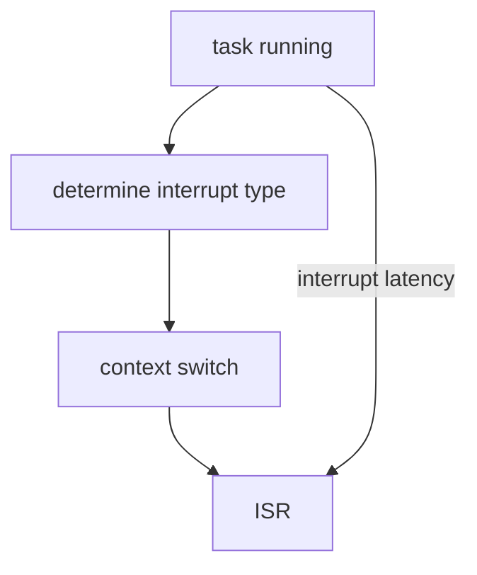
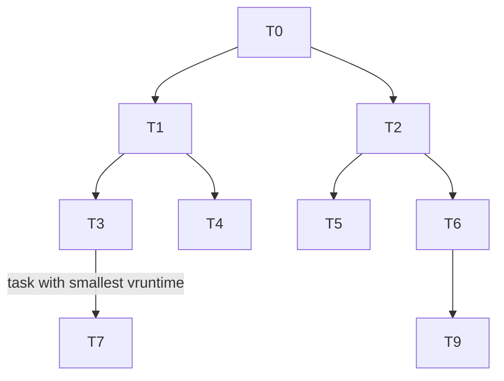

[[_Operating System Fundamentals]]

## Basic Concepts

With multiprogramming, we try to maximize CPU utilization and minimize idle time. Several processes are kept in memory at one time; when one process has to wait, another process can take over use of the CPU. This **scheduling** is a fundamental OS function - almost all computer resources are scheduled before use.

Process execution consists of a cycle of CPU execution and I/O wait. Processes alternate between these two states. They begin with a **CPU Burst**, followed by an **I/O Burst**, an so on. The final CPU burst ends with a system request to terminate execution.

### CPU Scheduler

The **CPU Scheduler** selects from among the processes in the ready queue and allocates a CPU core to one of them. Scheduling decisions take place when a process
1. Switches from running to waiting state
2. Switches from running to ready state
3. Switches from waiting to ready state
4. Terminates

### Preemptive and Nonpreemptive Scheduling

When scheduling takes place under circumstances 1 and 4, the scheme is **nonpreemptive** (and 2,3 are **preemptive**).

Under nonpreemptive scheduling, once the CPU has been allocated to a process, it keeps the CPU until it is released by terminating or switching to the waiting state.

Preemptive scheduling can result in race conditions when data is shared among several processes. If two processes share the same data, while one is updating the data it is preempted so that the second process can run. 


### Dispatcher

The **Dispatcher** module gives control of the CPU to the process selected by the [[#CPU Scheduler]]. This involves (1) switching context, (2) switching to user mode, (3) jumping to the proper location in the user program to restart that program.

**Dispatch Latency** is the time it takes for the dispatcher to stop one process and start another.


## Scheduling Criteria

Many criteria have been suggested for comparing CPU-scheduling algorithms, including
- **CPU Utilization** - we want to keep the CPU as busy as possible
- **Throughput** - the number of processes that are completed in a unit of time
- **Turnaround Time** - the time spent waiting in the ready queue, executing on the CPU, and doing I/O
- **Waiting Time** - the time spent waiting in the ready queue
- **Response Time** - the time it takes from the submission of a requests to the first response

The optimal criteria would follow as
- Maximizing CPU utilization and throughput
- Minimizing turnaround time, waiting time and response time


## Scheduling Algorithms

### First-Come, First-Served Scheduling

This is the simplest CPU-scheduling algorithm. The process that requests the CPU first is allocated to the CPU first. This can be easily implemented via a FIFO queue.

The downside to the FCFS policy is that the average waiting time is quite long.

Suppose we have processes with burst times $(P_1, 24s), (P_2, 3s), (P_3, 3s)$. If the processes arrive in the order $P_1, P_2, P_3$, the [[Gantt Chart]] for the schedule is 

```mermaid
---
displayMode: compact
---
gantt
	dateFormat s
	axisFormat %S
    section Schedule
        P1 :a1, 0, 24s
        P2 :a2, 24, 3s
		P3 :a3, 27, 3s
```

So the waiting time for $P_1=0, P_2=24, P_3=27$ which leads to an average waiting time of $(0+24+27)/3=17$.

However if the processes arrive in the order $P_2, P_3, P_1$, the Gantt Chart is


Which has waiting times $P_1=6, P_2=6, P_3=3$ with an average waiting time of $(6+0+3)/3=3$. Obviously much faster.

This is the **Convoy Effect** - short processes go behind long processes.

### Shortest-Job-First (SJF) Scheduling

This associates with each process the length of its next CPU burst. These lengths are used to schedule the process with the shortest time.

SJF is optimal - it gives a minimum average waiting time for a given set of processes.

#### How do we determine the length of the next CPU burst?

We can only estimate the length - it should be similar to the previous one. We then pick the process with the shorted predicted next CPU burst.

This can be done by using the length of previous CPU bursts using exponential averaging. If $t_n$ is the actual length of the $n^{th}$ CPU burst, $\tau_{n+1}$ is the predicted value for the next CPU burst, and $\alpha \in [0,1]$ (typically 0.5), then

$$
\tau_{n+1} = \alpha t_n + (1-\alpha)\tau_n
$$

### Round-Robin Scheduling

Each process gets a small unit of CPU time called a **time quantum** $q$ (usually 10-100ms). After this time is elapsed, the process is preempted and added to the end of the ready queue.

If there are $n$ processes in the ready queue, then each process gets $1/n$ of the CPU time in chunks of at most $q$ time units at once. No process will wait more than $(n-1)q$ time units.

A timer interrupts every quantum to schedule the next process.

Large $q$ is similar to [[#First-Come, First-Served Scheduling|FCFS]], and small $q$ is how we achieve Round-Robin (RR).

Suppose we have $(P_1,24s), (P_2,3s), (P_3, 3s)$ with $q=4$. The Gantt Chart would be

Typically this leads to a higher average turnaround than [[#Shortest-Job-First (SJF) Scheduling|SJF]], but a better response. We should have a large $q$ compared to the context switch time.


### Priority Scheduling

A priority number gets associated with each process. The CPU is allocated to the process with the highest priority (smallest number ~ highest priority).

[[#Shortest-Job-First (SJF) Scheduling|SJF]] is a special case of Priority Scheduling where the priority is the inverse of the predicted next CPU burst time.

An analogy is that the problem here is **starvation** (low priority processes may never execute) which is solved by **aging** (as time progresses the priority of the processes increase).

Priorities can be defined internally or externally. Internally defined priorities use some measurable quantities to compute the priority such as time limits, memory requirements, etc. Externally defined priorities are set by criteria such as the process type, amount of funds being paid for CPU use, etc.


### Multilevel Feedback Queue Scheduling

The ready queue consists of multiple queues. The multilevel queue scheduler is defined by
- The number of queues
- The scheduling algorithms for each queue
- Method used to determine when to upgrade a process
- Method used to determine when to demote a process
- The method used to determine which queue a process will enter when that process needs service
- Scheduling among the queues

With priority scheduling we have separate queues for each priority - you schedule the process in the highest-priority queue.

Prioritization is based upon process type, for example (in order)
1. Real-time processes
2. System processes
3. Interactive processes
4. Batch processes

#### Example

Suppose we have three queues $Q_0$ ([[#Round-Robin Scheduling|RR]] with time quantum 8ms), $Q_1$ (RR with time quantum 16ms) and $Q_2$ ([[#First-Come, First-Served Scheduling|FCFS]]).

A new process enters $Q_0$. When it gains CPU, the process receives 8ms. If it does not finish in 8ms, it is moved to $Q_1$. Again, it receives 16ms and if it does not complete it is moved to $Q_2$.


## Thread Scheduling

To run a CPU, user-level threads must ultimately be mapped to an associated kernel-level thread. What kind of scheduling issues involving user/kernel-level threads are there?

### Contention Scope

One distinction between user/kernel-level threads is how they are scheduled. On systems implementing [[Ch.4 Threads & Concurrency#Many-to-One|many-to-one]] and [[Ch.4 Threads & Concurrency#Many-to-Many|many-to-many]] models, the thread library schedules user-level threads to run on available LWP. This is known as **Process-Contention Scope (PCS)** since competition for CPU takes place among threads belonging to the same process. 

To decide which kernel-level thread to schedule on a CPU, the kernel uses **System-Contention Scope (SCS)** since competition for the CPU takes place among all threads in the system. Systems using the [[Ch.4 Threads & Concurrency#One-to-One|one-to-one]] model such as Windows/Linux schedule threads using only SCS.


## Multi-Processor Scheduling

What if multiple CPUs are available? This is where **load sharing** (when multiple threads running in parallel) becomes possible, however scheduling becomes more complex.

One approach to multiprocessor scheduling is **asymmetric multiprocessing**, where there is one core that handles all the system data structures which reduces the need for data sharing. The downfall is potential bottlenecking.

Another approach is **symmetric multiprocessing (SMP)**. This is where each processor is self scheduling. Scheduling proceeds by having the scheduler for each processor examine the ready queue and select a thread to run.


### Multicore Processors

A recent trend is to place processor cores on the same physical chip - this is faster and consumes les power. Multiple threads per core is also growing as well.


## Real-Time CPU Scheduling

Scheduling for real-time OS involves special issues. **Soft real-time systems** provide no guarantee when a critical real-time process will be scheduled, and **hard real-time systems** require that a task is serviced by its deadline.

### Event Latency

The amount of time that elapses from when an event occurs to when it is serviced is called **event latency**. There are two types of latencies that can affect performance.

#### Interrupt Latency

**Interrupt latency** is the time from the arrival of the interrupt to the start of the routine that services interrupt.




#### Dispatch Latency

**Dispatch latency** is the time for the scheduler to take the current process off the CPU and to switch to another


### Priority-Based Scheduling

For real-time scheduling, the scheduler must support preemptive, [[#Priority-Based Scheduling|priority-based scheduling]]. However, this only guarantees soft real-time scheduling. We must also provide the ability to meet deadlines.

Processes have new characteristics: **periodic** ones require CPU at constant intervals. These processes have a processing time $t$, deadline $d$, period $p$ such that $0\leq t\leq d\leq p$. The rate of a periodic task is $1/p$.


### Rate-Monotonic Scheduling

For **Rate-Monotonic Scheduling**, a priority is assigned based on the inverse of its period (i.e., shorter periods get higher priority and vice versa).

If a lower-priority process is running and a higher-priority process becomes available to run, it will preempt the lower-priority process to run the higher one.


### Earliest-Deadline-First Scheduling

In **Earliest-Deadline-First Scheduling**, priorities are assigned according to deadlines. The earlier the deadline, the higher the priority.


### Proportional Share Scheduling

Here we allocate $T$ shares among all the processes in the system. An application receives $N<T$ shares to ensure that each application will receive $N/T$ of the total processor time.


### POSIX Real-Time Scheduling

The POSIX API defines two scheduling classes for real-time threads:
1. `SCHED_FIFO` - threads are scheduled using [[#First-Come, First-Served Scheduling|FCFS]] strategy with a FIFO queue. There is no time-slicing for threads of equal priority
2. `SCHED_RR` - similar to `SCHED_FIFO` except time-slicing occurs for threads of equal priority

Two functions are defined for getting/setting scheduling policy
```c
pthread_attr_getsched_policy(pthread_attr_t *attr, int *policy);

pthread_attr_setsched_policy(pthread_attr_t *attr, int policy);
```

```c
#include <pthread.h>
#include <stdio.h>
#define NUM_THREADS 5

void *runner(void *param)
{
	// do some work
	pthread_exit(0);
}

int main()
{
	int i, policy;
	pthread_t_tid[NUM_THREADS];
	pthread_attr_t attr;
	// get default attributes
	pthread_attr_init(&attr);
	// get current scheduling policy
	if (pthread_attr_getsched_policy(&attr, &policy) != 0)
	{
		fprintf(stderr, "Unable to get policy\n");
	}
	else
	{
		if (policy == SCHED_OTHER) printf("SCHED_OTHER\n");
		else if (policy == SCHED_RR) printf("SCHED_RR\n");
		else if (policy == SCHED_FIFO) printf("SCHED_FIFO\n");
		// set scheduling policy
		if (pthread_attr_setsched_policy(&attr, SCHED_FIFO) != 0)
			fprintf(stderr, "Unable to set policy");
		
		for (int i = 0; i < NUM_THREADS; i++)
			pthread_create(&tid[i], &attr, runner, NULL);
			
		// join each thread
		for (int i = 0; i < NUM_THREADS; i++)
			pthread_join(tid[i], NULL);
	}
}
```


## Operating-System Examples

### Linux Scheduling

Scheduling in Linux is based on **scheduling classes**. Each class gets assigned a specific priority and the scheduler picks the highest priority task in the highest scheduling class.

Instead of the quantum being based on fixed time allotments, it is based on the proportion of CPU time. The quantum is calculated based on the **nice value** (from -20 to +19) assigned to each task. A lower nice value is a higher priority task.

Linux uses a Completely Fair Scheduler (CFS) which provides an efficient algorithm for selecting which task to run next. Each task gets placed in a [[Red-Black Tree]] whose key is based on the value of its virtual run time `vruntime`.

When a task becomes runnable, it gets added to the tree. If a task on the tree is not runnable, it gets removed. Tasks with less `vruntime` are toward the left side the tree.




### Windows Scheduling

Windows uses [[#Priority-Based Scheduling|priority-based preemptive scheduling]], so the highest-priority thread runs next and the **dispatcher** is the scheduler.

A thread selected to run by the dispatcher will run until
- it is preempted by a higher-priority thread
- it terminates
- its time quantum ends
- it calls a blocking system call (such as for I/O)

Priorities are divided into two classes. The **variable class** contains threads having priorities 1-15 while the **real-time class** contains threads with priorities ranging from 16-31.


### Solaris Scheduling

Solaris uses [[#Priority-Based Scheduling]] with six available classes (in order of priority)
1. Interactive (IA)
2. Time sharing (default) (TS)
3. Fixed Priority (FP)
4. Fair Share (FSS)
5. System (SYS)
6. Real time (RT)

A thread can be in only one class at a time - each thread has its own scheduling algorithm.


## Algorithm Evaluation

How do we select a CPU-scheduling algorithm for an OS? We must first determine criteria, then evaluate algorithms.

We can also use **deterministic modelling** (a type of **analytic evaluation**). It takes a particular predetermined workload and defines the performance of each algorithm for that workload.

Consider 5 processes arriving at $t=0$: $(P_1,10), (P_2,29), (P_3, 3), (P_4, 7), (P_5, 12)$.
For each algorithm, calculate the minimum average waiting time. It is simple and fast, but requires exact numbers for inputs and applies only to those inputs.

- [[#First-Come, First-Served Scheduling|FCS]] is 28 ms

- Non-preemptive [[#Shortest-Job-First (SJF) Scheduling|SJF]] is 13ms

```mermaid
---
displayMode: compact
---
gantt
	dateFormat s
	axisFormat %S
    section Schedule
        P3 :a1, 0, 3s
        P4 :a2, 3, 7s
		P1 :a3, 10, 10s
		P5 :a4, 20, 12s
		P2 :a5, 32, 29s
```

- [[#Round-Robin Scheduling|RR]] is 23ms

```mermaid
---
displayMode: compact
---
gantt
	dateFormat s
	axisFormat %S
    section Schedule
        P1 :a1, 0, 10s
        P2 :a2, 10, 10s
		P3 :a3, 20, 3s
		P4 :a4, 23, 7s
		P5 :a5, 30, 10s
		P2 :a6, 40, 10s
		P5: a7, 50, 2s
		P2: a8, 52, 9s
```


### Queuing Models

**Queuing Models** describes the arrival of processes along with CPU and I/O bursts probabilistically. It computes the average throughput, utilization, waiting time, etc.

#### Little's Formula

Let $n$ be the average queue length, $W$ be the average waiting time in queue, $\lambda$ be the average arrival rate into the queue. Little's law says that in steady state, processes leaving the queue must equal processes arriving, thus

$$
n=\lambda\times W
$$
and is valid for any scheduling algorithm and arrival distribution.

E.g., if on average 7 processes arrive per second and normally 14 processes in the queue, then the average wait time per process $W$ is 2 seconds.


### Simulations

[[#Queuing Models]] are limited - simulations are more accurate. We can program a model of a computer system with the clock being a variable and gather statistics that indicate an algorithm's performance.

Even simulations have limited accuracy. If we were to just implement a new scheduler and test in real systems, this would be very costly and risky (not to mention that environments vary). Most flexible schedulers can be modified per-site/system (or through APIs).