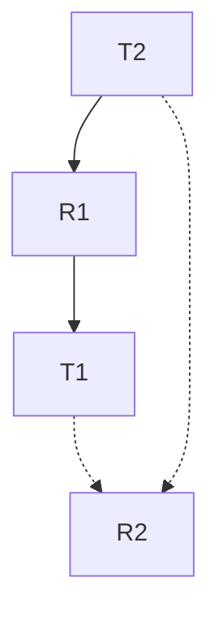
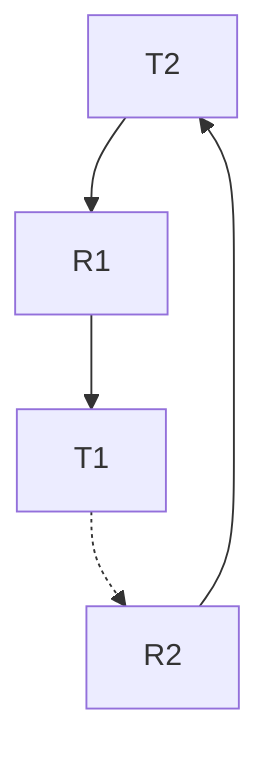

[[_Operating System Fundamentals]]


# System Model

The system model describes a system consisting of resources with types $R_{1},R_{2},\dots,R_{m}$ (e.g., CPU cycles, memory space, I/O devices).

Each resource type $R_{i}$ has $W_{i}$ instances.

Each process utilizes a resource as follows
1. request
2. use
3. release


# Deadlock Characterization

Deadlocks can arise if four conditions hold simultaneously
- **Mutual exclusion:** only one thread at a time can use a resource
- **Hold and wait:** a thread holding at least one resource is waiting to acquire additional resources held by other threads
- **No preemption:** a resource can be released only voluntarily by the thread holding it, after that thread has completed its task
- **Circular wait:** there exists a set $\{ T_{0},T_{1},\dots T_{n} \}$ of waiting threads such that $T_{n}$ is waiting for a resource that is held by $T_{n+1}$ (and $T_{n}$ is waiting for $T_{0}$).


# Resource-allocation graph

> [!definition|*] Resource-allocation graph
> A **resource-allocation graph** consists of a set of vertices $V$ and edges $E$ and is partitioned into two types
> - $T = \{ T_{1},T_{2},\dots,T_{n} \}$ consisting of all threads in the system
> - $R = \{ R_{1},R_{2},\dots, R_{m} \}$ consisting of all resource types in the system
> 
> The graph consists of **request edges** $T_{i} \to R_{j}$ and **assignment edges** $R_{j} \to T_{i}$.

> [!example|*]
> - One instance of $R_{1}$
> - Two instances of $R_{2}$
> - One instance of $R_{3}$
> - Three instances of $R_{4}$
> - $T_{1}$ holds one instance of $R_{2}$ and is waiting for an instance of $R_{1}$
> - $T_{2}$ holds one instance of $R_{1}$, one instance of $R_{2}$, and is waiting for an instance of $R_{3}$
> - $T_{3}$ holds one instance of $R_{3}$

**With deadlock**
![[rag-deadlock.png|300x400]]

**Without deadlock**
![[rag-nodeadlock.png|300x400]]

`\end{proof}`

- graph contains no cycles $\implies$ no deadlock
- graph contains cycle $\implies$
	- if only one instance per $R_{i}$, deadlock
	- if several instances per $R_{i}$, possible deadlock


# Deadlock prevention

We invalidate one of the four necessary conditions for the deadlock:
- **Mutual exclusion:** not required for sharable resources and must hold for non-sharable resources
- **Hold and wait:** must guarantee that whenever a thread requests a resource, it does not hold any other resources
	- Require threads to request and be allocated its resources before it begins executing (or when it has no resources)
	- Low resource utilization so starvation is possible
- **No preemption:** if a process with resources requests another that cannot be immediately allocated, all resources being held are released
	- Preempted resources are added to the list of resources for which the thread is waiting
	- Thread will be restarted iff it can regain its old resources and the new ones it wants
- **Circular wait:** Impose a total ordering of all resource types, and require that each thread requests resources in an increasing order of enumeration

Invalidating the **circular wait** is most common. We simply assign each resource a unique number, and each resource must be acquired in order.

For example, if `first_mutex = 1` and `second_mutex = 5`, the code below could not be written
```c
pthread_mutex_lock(&second_mutex);
pthread_mutex_lock(&first_mutex);
// do work
pthread_mutex_unlock(&first_mutex);
pthread_mutex_unlock(&second_mutex);
```

# Deadlock avoidance

This requires that a system has some additional information available. The simplest and most useful model requires that each thread declares the **maximum number** of resources of each type that it may need.

The deadlock-avoidance algorithm dynamically examines the resource-allocation state to ensure there can never be a circular-wait condition. The resource-allocation sate is defined by the number of allocated resources and the maximum demands of the process.

## Safe state

When a thread requests an available resource, the system must decide if immediate allocation leaves the system in a safe state.

> [!definition|*] Safe state
> A system is in **safe state** if there exists a sequence $\langle T_{1}, T_{2}, \dots, T_{n} \rangle$ of ALL threads in the system such that for each $T_{i}$, the resources it can request can be satisfied by currently available resources + resources held by all $T_{j<i}$.

That is,
- if $T_{i}$ resource needs are not immediately available, $T_{i}$ can wait until all $T_{j}$ complete
- When $T_{j}$ completes, $T_{i}$ can obtain needed resources, execute, return resources, terminate
- When $T_{i}$ terminates, $T_{i+1}$ can obtain needed resources, and so on

Also,
- System is in safe state $\implies$ no deadlocks
- System is in unsafe state $\implies$ possible deadlock
- Avoidance $\implies$ ensures a system will never enter unsafe state

If we have a single instance of a resource type, we use a [[#Resource-allocation graph]]. If we have multiple instances of a resource type, we use [[#Banker's algorithm]].

For the [[#Resource-allocation graph]], a **claim edge** $T_{i} \to R_{j}$ indicates that process $T_{i}$ may request resource $R_{j}$, represented by a dashed line.
- A claim edge converts to a **request edge** when a thread requests a resource
- Request edge converts to an **assignment edge** when the resource is allocated to the thread
- An assignment edge reconverts to a **claim edge** when a resource is released by a thread
- Resources must be claimed *a priori* in the system

Resource-allocation graph


Unsafe state in resource-allocation graph


Suppose that thread $T_{i}$ requests resource $R_{j}$. The request can be granted only if **converting the request edge to an assignment edge does not result in the formation of a cycle in the RAG**.

## Banker's algorithm

Banker's algorithm is used when there are multiple instances of resources.
- Each thread must claim maximum use a priori
- When a thread requests a resource, it may have to wait
- When a thread gets all its resources it must return them in a finite amount of time

### Data structure

Let $n$ be the number of processes and $n$ be the number of resource types
- **Available:** vector of length $m$
	- If `available[j]=k` there are $k$ instances of resource $R_{j}$ available
- **Max:** $n \times m$ matrix
	- If `Max[i,j]=k`, process $T_{i}$ may request at most $k$ instances of $R_{j}$.
- **Allocation:** $n \times m$ matrix
	- If `Allocation[i,j]=k`, $T_{i}$ is currently allocated $k$ instances of $R_{j}$
- **Need:** $n \times m$ matrix
	- If `Need[i,j]=k`, $T_{i}$ may need $k$ more instances of $R_{j}$ to complete its task

### Safety algorithm

1. Let `Work` and `Finish` be vectors of length `m`,`n` respectively. Initialize `Work = Available` and `Finish[i] = false` for $i=0,1,\dots n-1$.
2. Find an $i$ such that both
	1. `Finish[i] = false`
	2. `Need[i] <= Work`
	are satisfied. If no $i$, go to step 4
3. `Work = Work + Allocation[i]` and `Finish[i] = true`. Go to step 2
4. If `Finish[i] == true` for all $i$, then system is in safe state

# Deadlock detection
