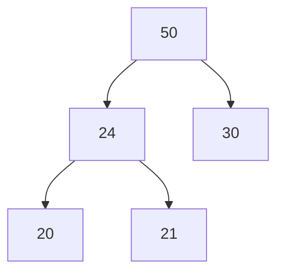
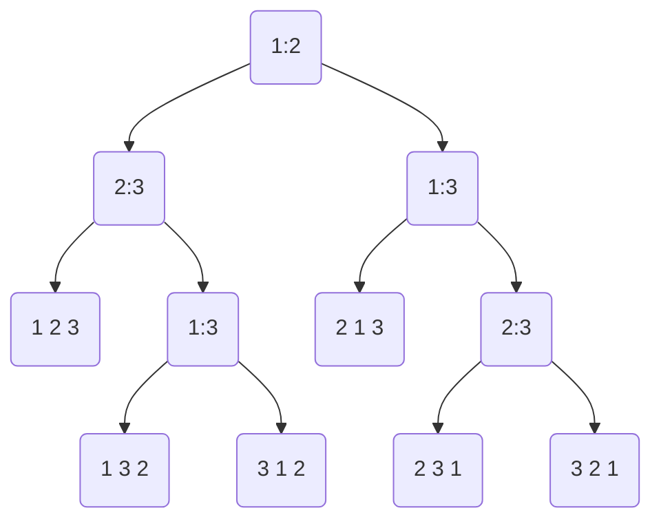

[[_Design and Analysis of Computer Algorithms]]

# Problem Definition

Given a list of $n$ elements $(a_i)$ taken from a totally ordered set $(S,\precsim)$, find a permutation of the elements $(a_i')$ such that $a_i'\precsim a_{i+1}'$  


# 2.1 Insertion Sort

Insertion sort involves taking each element of the sequence in order ($a_1, a_2,...$) and sorting all the elements that come before it.

## Algorithm Insertion-Sort
**Input:** An array of $n$ elements, $L[1...n]$, drawn from a totally ordered set.
**Output:** $L[1...n]$ sorted in ascending order.

```python
Algorithm InsertionSort
Input: An array of n elements L[1 ... n] drawn from a totally ordered set
Output: L[1 ... n] sorted in ascending order
begin
	for i := 2 to n do
		j := i - 1
		while L[j] > L[j+1] and j > 0 do
			swap L[j] and L[j+1]
			j := j - 1
		endwhile
end.
```

### Time Complexity

#### Worst-case

For each $i$, at most $i-1$ comparisons are performed.
Therefore
$$
\begin{align}
T(n) \leq \sum_{i=2}^n(i-1) &=\frac{(n+2)(n-1)}{2}-(n-1)\\
&= O(n^2)
\end{align}
$$

#### Average-case

Assume that (1) all elements in $L$ are distinct and (2) every $L[i]$ is equally likely to be in any one of the $i$ gaps in $L[1...i-1]$.

So the probability that $L[i]$ falls in any one of the $i$ gaps is $1/i$.

When $L[i]$ falls inside gap $j$, there are $i-j+1$ comparisons performed unless $j=1$, in which there are $i-1$ comparisons.

To insert $L[i]$ into its position will take

$$
\begin{align}
\sum_{j=2}^{i}\frac{1}{i}((i-j)+1) + \frac{1}{i}(i-1) &= \sum_{j=1}^i\frac{1}{i}j + \frac{1}{i}(i-1)\\
&= \frac{i+1}{2}-\frac{1}{i}
\end{align}
$$

and hence

$$
\begin{align}
T_{ave}(n) &= \sum_{i=2}^n\left(\frac{i+1}{2}-\frac{1}{i}\right)\\
&= \Theta(n^2)
\end{align}
$$

## Definition: In-place Algorithm

A sorting algorithm is said to be **in-place** if the amount of extra space it uses is $O(1)$.

Clearly, [[#2.1 Insertion Sort|insertion sort]] uses $O(1)$ extra space, so it is an in-place sorting algorithm.

## Definition: Permutation

A **permutation** on $\{1,2,...,n\}$ denoted by $\pi$, is a one-to-one function from $\{1,2,...,n\}$ to $\{1,2,...,n\}$.

A permutation $\pi$ can be expressed as

$$
\pi = \begin{pmatrix}
1 & 2 & 3 & \cdots & n \\
\pi(1) & \pi(2) & \pi(3) & \cdots & \pi(n)
\end{pmatrix}
$$

## Definition: Inverse of a Permutation

An **inverse** of a permutation $\pi$ is an ordered pair $(\pi(i),\pi(j))$ such that $i<j$ and $\pi(i)>\pi(j)$.

E.g., in the permutation 3 1 4 5 2, the inversions are $(3,1), (3,2), (4,2), (5,2)$.

Since comparing and swapping a pair of adjacent elements can eliminate at most one inversion, any sorting algorithm that sorts by comparing and swapping adjacent elements must make at least $k$ comparisons to sort an input list (permutation) with $k$ inversions.


# 2.3 Quicksort

## Algorithm Quicksort

```python
Algorithm Quicksort(L, lower, upper)
Input: L[lower ... upper]
Output: L[lower ... upper] sorted in ascending order
begin
	if lower < upper then
		splitpoint = split(L, lower, upper)
		Quicksort(L, lower, splitpoint - 1)
		Quicksort(L, splitpoint + 1, upper)
end.

==================

Algorithm Split(L, lower, upper)
Input: L[lower ... upper]
Output: splitpoint such that
				L[i] < L[splitpoint]   for lower <= i < splitpoint
				L[splitpoint] <= L[i]  for splitpoint < i <= upper
begin:
	x := L[lower]
	splitpoint := lower
	for index := lower + 1 to upper do
		if L[index] < x then
			splitpoint := splitpoint + 1
			swap L[splitpoint] and L[index]
	swap L[splitpoint] and L[lower]
	return splitpoint
end.

==================

Call Quicksort(L, 1, n)
```

Note that [[#Algorithm Quicksort|Split]] splits $L[lower ... upper]$ into two sublists $L[lower ... splitpoint - 1]$ and $L[splitpoint + 1 ... upper]$ such that:
$L[splitpoint]=x$, and $L[i]<x\leq L[j]$ where $lower\leq i < splitpoint$ and $splitpoint < j \leq upper$.

The last statement of [[#Algorithm Quicksort|Quicksort]] swaps the values in $L$ at the splitpoint and lower indices to create the desired sort.


### Correctness

> [!lemma|2.5]
> At the end of each iteration of the for loop, Procedure [[#Algorithm Quicksort|Split]] splits $L[lower+1, index]$ into two sublists $L[lower+1 \dots splitpoint]$ and $L[splitpoint+1 \dots index]$ such that $L[i] < x, lower < i \leq splitpoint$, and $x \leq L[j], splitpoint < j \leq index$.

^784192

`\begin{proof}`
(By induction on index).
**(Induction basis)** When $index=lower+1$, one of the following is satisfied
$$
\begin{align}
&(1) \ \ \ L[lower+1 \dots splitpoint] = \emptyset, &L[splitpoint + 1 \dots index] = L[index] \geq x \\
&(2) \ \ \ L[lower+1 \dots splitpoint] = L[index] < x, &L[splitpoint + 1 \dots index] = \emptyset
\end{align}
$$
 
**(Induction Hypothesis)** Suppose this is true for $i=index-1$ where $lower+1 < i \leq upper$.

**(Induction Step)** Consider $i=index$. We have two cases:
*Case 1:* $L[i] < x$
	In this case the if statement passes, so $splitpoint := splitpoint + 1$ and $L[splitpoint] \leftrightarrow L[i]$.
	From the base case and due to the swap, we can derive that all elements in $L[lower+1 \dots splitpoint]$ are $<x$. It follows that all elements in $L[splitpoint + 1 \dots i]$ either do not exist (i.e., set is empty), or are all $\geq x$ from the base case and the swap.

*Case 2*: $L[i] \geq x$
	In this case nothing happens since the if statement does not pass, so all the elements in $L[splitpoint+1 \dots i]$ are obviously still $\geq x$ (case assumption) and $L[lower+1 \dots splitpoint]$ is still satisfied since neither $lower$ or $splitpoint$ are incremented.
 `\end{proof}`

> [!corollary|2.5.1]
> Procedure [[#Algorithm Quicksort|Split]] splits $L[lower \dots upper]$ into two sublists $L[lower \dots splitpoint - 1]$ and $L[splitpoint + 1 \dots upper]$ such that:
> $L[splitpoint] = x, L[i] < x \leq L[j]$ where $lower \leq i < splitpoint$, and $splitpoint < j \leq upper$.

^21b8e6

`\begin{proof}`
By [[#^784192|Lemma 2.5]], upon exiting the for loop, this condition is immediately satisfied if we let $index=upper$.
`\end{proof}`

> [!theorem|2.6]
> Algorithm [[#Algorithm Quicksort|Quicksort]] correctly sorts $L[1\dots n]$ into ascending order.

`\begin{proof}`
(By induction on $n$).
**(Induction Basis)** A list of one element is already sorted.

**(Induction Hypothesis)** Suppose [[#Algorithm Quicksort|Quicksort]] correctly sorts all input lists of length $<n$ for $n \geq 2$.

**(Induction Step)** Consider the list $L[1 \dots n]$. By [[#^21b8e6|Collary 2.5.1]], Procedure [[#Algorithm Quicksort|Split]] splits $L[1 \dots n]$ into two sublists around $splitpoint$, so we have $L_{1}[1 \dots splitpoint - 1]$ and $L_{2}[splitpoint + 1 \dots n]$, where each element in $L_{1}$ is less than $L[splitpoint]$, and each element in $L_{2}$ is greater than $L[splitpoint]$. This is called recursively until we are left with a set of partitions containing one element, in which the induction basis applies to each partition.
`\end{proof}`

### Time complexity

#### Worst-case

> [!theorem|2.7]
> Algorithm [[#Algorithm Quicksort|Quicksort]] performs $\Theta(n^{2})$ comparisons in the worst-case to sort a list of $n$ elements.

`\begin{proof}`
The worst-case occurs when the input list is already sorted.

As the smallest element in the input list $L[1 \dots n]$ is $L[1]$, Procedure [[#Algorithm Quicksort|Split]] will do $(n-1)$ comparisons to split $L[1 \dots n]$ into an empty list and the sublist $L[2 \dots n]$ (in general, for $1 \leq i \leq n$, the smallest element in $L[i \dots n]$ is $L[i]$).

Procedure [[#Algorithm Quicksort|Split]] will do $(n-i)$ comparisons to split $L$ into an empty sublist and $L[n-i+1 \dots n]$. So the total number of comparisons done is

$$
\begin{align}
\sum_{i=1}^{n-1} (n-i) &= n\sum_{i=1}^{n-1} 1 - \sum_{i=1}^{n-1} i \\
&= n(n-1) - \frac{1}{2} n(n-1) \\
&= \Theta(n^{2})
\end{align}
$$
`\end{proof}`

#### Average-case

> [!assumption|*]
> 1. All permutations of the input are equally likely
> 2. All elements are distinct

Let $n = upper - lower + 1$. By Assumption 1 the rank of $x = L[lower]$ in $L$ (i.e., the order number) is equally likely to be any index $i$ such that $1 \leq i \leq n$. So the probability that $x$ is the $i$th element in $L$ is $1 / n$.

Let $T_{ave}(n)$ denote the average time complexity of [[Ch.2 Sorting#Algorithm Quicksort|Quicksort]] on input size $n$.

If $x=L[lower]$ is the $i$th element in $L$, then the average time complexity of the two recursive calls in [[Ch.2 Sorting#Algorithm Quicksort|Quicksort]] are $T_{ave}(i-1)$ and $T_{ave}(n-i)$ respectively. The expected time for [[Ch.2 Sorting#Algorithm Quicksort|Quicksort]] when $L[lower]$ is the $i$th element in $L$ is thus:

$$
\frac{1}{n} \left( T_{ave}(i-1) + T_{ave}(n-i) \right)
$$
[[Ch.2 Sorting#Algorithm Quicksort|Split]] takes $(n-1)$ time to find a $splitpoint$. Thus, we have:

$$
T_{ave}(n) = \begin{cases}
(n-1) + \sum_{i=1}^{n} \frac{1}{n}(T_{ave}(i-1) + T_{ave}(n-i)) & n>1 \\
0 & n = 1 \\
0 & n = 0
\end{cases}
$$

$$
\begin{align}
\implies T_{ave}(n) &= (n-1) + \frac{1}{n} \sum_{i=1}^{n} \left( T_{ave}(i-1) + T_{ave}(n-i) \right) \\
&= (n - 1) + \frac{1}{n} \sum_{i=2}^{n-1} 2T_{ave}(i)
\end{align}
$$

We solve the above recurrence by first multiplying by $n$ on both sides
$$
nT_{ave}(n) = n(n-1) + \sum_{i=2}^{n-1} 2T_{ave}(i)
$$
and then shifting $n \to n-1$
$$
(n-1)T_{ave}(n-1) = (n-1)(n-2) + \sum_{i=2}^{n-2} 2T_{ave}(i)
$$
subtracting the above two equations yields:
$$
\begin{align}
nT_{ave}(n) - (n-1)T_{ave}(n-1) &= n(n-1) - (n-1)(n-2) + \sum_{i=2}^{n-1} 2T_{ave}(i) - \sum_{i=2}^{n-2} 2T_{ave}(i) \\
nT_{ave}(n) &= 2(n-1) + 2T_{ave}(n-1) + (n-1)T_{ave}(n-1) \\
nT_{ave}(n) &= 2(n-1) + (n + 1)T_{ave}(n-1)
\end{align}
$$

Which can be solved with Harmonic Functions since this is of the form

$$
\alpha_{n}T(n) = \beta_{n}T(n-1) + \gamma_{n}
$$
where $\alpha_{n}, \beta_{n}, \gamma_{n}$ are all functions of $n$.

This leads to a result of $T_{ave}(n) = \Theta(n \lg n)$.


# 2.5 Mergesort

Mergesort works by continually dividing a list into half, sorting each smaller list, and then merging the resulting lists for the result.


## Algorithm Mergesort

```python
Algorithm Mergesort(L, lower, upper)
Input: L[lower ... upper]
Output: L[lower ... upper] sorted in ascending order
begin
	if lower < upper then
		mid = floor( (lower + upper) / 2 )
		Mergesort(L, lower, mid)
		Mergesort(L, mid + 1, upper)
		Merge L[lower ... mid] and L[mid + 1 ... upper] into L[lower ... upper]
end.

==================

Algorithm Merge
Input: Two sorted lists A[1 ... m] and B[1 ... n]
Output: A sorted list C[1 ... m+n] which contains all the elements of A and B
begin
	indexA, indexB, indexC := 1
	while indexA <= m and indexB <= n do
		if A[indexA] < B[indexB] then
			C[indexC] := A[indexA]
			indexA := indexA + 1
		else
			C[indexC] := B[indexB]
			indexB := indexB + 1
		indexC := indexC + 1
		
	if indexA > m then
		copy B[indexB ... n] into C[indexC ... m+n]
	else
		copy A[indexA ... m] into C[indexC ... m+n]
end.
```


### Correctness

> [!lemma|2.8]
> Algorithm [[Ch.2 Sorting#Algorithm Mergesort|Merge]] correctly merges the two sorted lists.

`\begin{proof}`
Use induction on $i$ to prove that the $i$th element moved into the output list is the $i$th smallest element in the combined list.
`\end{proof}`

> [!lemma|2.9]
> Merging two sorted lists of sizes m, n respectively, requires at most $m + n - 1$ comparisons.

`\begin{proof}`
Every comparison moves one element to the output list except for the last comparison, which moves two or more elements to the output list. Once an element is moved to the output list, it will not be compared again. Since there are a total of $m+n$ elements, it thus takes at most $m+n-1$ comparisons to merge the sorted lists.
`\end{proof}`

> [!theorem|2.10]
> Algorithm [[Ch.2 Sorting#Algorithm Mergesort|Mergesort]] correctly sorts the given $n$ elements in ascending order.

`\begin{proof}`
(By induction on $n$).
`\end{proof}`

### Time complexity

Note that the key operation is the comparison of two items.
#### Worst-case

Let $T(n)$ be the time required to sort a list of $n$ elements with Mergesort. Then we have

$$
T(n) = \begin{cases}
T\left( \left\lfloor  \frac{n}{2}  \right\rfloor  \right) + T\left( \left\lceil  \frac{n}{2}  \right\rceil \right) + (n-1)  & n>1 \\
0 & n \leq 1
\end{cases}
$$
Let $T_{\lfloor  \rfloor}(n) = 2T\left( \left\lfloor  \frac{n}{2}  \right\rfloor \right) + (n-1)$ and $T_{\lceil  \rceil}(n) = 2T\left( \left\lceil  \frac{n}{2}  \right\rceil \right) + (n-1)$, note that $T(n)=T_{\lfloor  \rfloor}(n) + T_{\lceil  \rceil}(n)$.

We can use the [[Ch.1 Searching an Ordered List#Master theorem|Master Theorem]] to solve this recurrence, since we have $n^{\log_{b}(a)}=n$ and $f(n) = n-1 = \Theta(n) = \Theta(n^{\log_{b}a}\lg n) = \Theta(n\lg n)$.

$$
\implies T_{\lfloor  \rfloor }(n), T_{\lceil  \rceil}(n) = \Theta(n\lg n)
$$

So therefore $T(n) = \Theta(n \lg n) + \Theta(n \lg n) + \Theta(n) = \Theta(n \lg n)$.
`\end{proof}`


# 2.6 Heapsort

A heap is a binary tree in which:
1. Every level must be completely filled except for the lowest level, which is filled left-to-right
2. Every node contains an element drawn from a totally ordered set $(S,\leq)$ which is greater than or equal to the elements stored at its children (this is the heap property).




From this we can derive the following.

> [!lemma|2.11]
> Every subtree of a heap is a heap

> [!lemma|2.12]
> The root node of a heap contains the largest element in the heap

^ab9173

> [!lemma|2.13]
> The height of a heap of $n$ nodes is $\lfloor \lg n \rfloor$

^812d47

Lemmas 2.11 and 2.12 are obvious. We can prove Lemma 2.13 below.
`\begin{proof}`
Recall the number of nodes in a complete binary tree of height $k$ is $2^{k+1}-1$.

Let $h$ be the height of a heap of $n$ nodes. Then $n$ is greater than the number of nodes in a complete binary tree of height $h-1$ and is less than or equal to the number of nodes in a complete binary tree of height $h$.

$$
\begin{align}
& 2^{(h-1) + 1}-1 < n \leq 2^{h+1} - 1  \\
& \implies 2^h \leq n < 2^{h+1} \\
& \implies h \leq \lg n < h + 1 \\
& \implies h = \lfloor \lg n \rfloor 
\end{align}
$$
`\end{proof}`

> [!remark|*]
> The level of a vertex $v$ in a rooted tree is
> $$ level(v) = \begin{cases} 0 & \text{if } v \text{ is the root} \\ level(f(v)) + 1 & \text{otherwise} \end{cases} $$
> Where $f(v)$ is the parent of $v$ in the tree


## FixHeap

Consider a binary tree $T$ which has the heap structure and the left and right subtrees of the roots are heaps, but the element stored in the root may violate the heap property.

Operation **FixHeap** rearranges the elements in $T$ such that the heap property is restored and the heap structure is maintained (i.e., it rearranges $T$ into a heap).

```python
Algorithm FixHeap
Method: Filter the element stored in the root, K, downward until it reaches a node where the heap property is satisfied.
begin
	while K is not a leaf do
		if K is greater than or equal to both of its children then
			exit
		else
			swap K with the larger of its children
end.
```


### Correctness

> [!lemma|2.14]
> [[Ch.2 Sorting#FixHeap|FixHeap]] correctly converts $T$ into a heap.

^81b771

`\begin{proof}`
First note that [[Ch.2 Sorting#FixHeap|FixHeap]] does not destroy the heap structure. At any time, only the node that contains $K$ may violate the heap property.

Since $K$ is filtering down the binary tree, it would eventually either reach a node at which the heap property is satisfied or reaches a leaf. In either case, the tree $T$ becomes a heap.
`\end{proof}`


### Time complexity

> [!lemma|2.15]
> Operation [[Ch.2 Sorting#FixHeap|FixHeap]] does at most $2*h_{T}$ comparisons, where $h_{T}$ is the height of $T$.

^ac5d36

`\begin{proof}`
$K$ is filtering down the tree implies that the while loop is iterated at most $h_{T}$ times. In each iteration, at most two comparisons are performed: one for determining the larger of the two children, and one for comparing $K$ with the larger of the two.
`\end{proof}`


## Building a heap

The problem here is defined as "Given a list of $n$ elements, construct a heap containing the $n$ elements". The method to solve this is described below.

Put the elements into a binary tree of $n$ nodes, $T$, which has the heap structure. Since every leaf in $T$ is a heap, we can convert $T$ into a heap in a bottom-up manner by repeatedly using [[Ch.2 Sorting#FixHeap|FixHeap]].

### Procedure BuildHeap

```python
Procedure BuildHeap(T)
1. Build a binary tree of n nodes, T, which has the heap structure and store the n elements into T
2. for l := height(T) - 1 to 0 do
	   for each subtree T0 rooted at level l do FixHeap(T0)
```

> [!lemma|2.17]
> Procedure [[Ch.2 Sorting#Procedure BuildHeap|BuildHeap]] takes $O(n)$ time to construct the heap $T$.

^fd9802

`\begin{proof}`
Step 1 takes $O(n)$ time.

For each node on level $l$, the binary tree rooted at that node has height at most $h_{T}-l=\lfloor \lg n \rfloor - l$ ([[#^812d47|Lemma 2.13]]).

By [[#^ac5d36|Lemma 2.15]], Procedure [[Ch.2 Sorting#FixHeap|FixHeap]] takes at most $2\left( \lfloor \lg n \rfloor - l \right)$ time to convert the subtree rooted at that node into a heap.

Since there are at most $2^l$ nodes on level $l$, the total time required to build the heap $T$ is thus at most
$$
\begin{align}
\sum_{l=0}^{h_{T}-1} 2^l \times 2(\lfloor \lg n \rfloor -l) &= 2 \sum_{l=0}^{\lfloor \lg n \rfloor } 2^l(\lfloor \lg n \rfloor - l) \\
&= 2 \sum_{l=0}^{\lfloor \lg n \rfloor} \frac{2^{\lfloor \lg n \rfloor }}{2^{\lfloor \lg n \rfloor - l}} (\lfloor \lg n \rfloor - l) \\
&\leq  2 \sum_{l=0}^{\lfloor \lg n \rfloor} \frac{n}{2^{\lfloor \lg n \rfloor - l}} (\lfloor \lg n \rfloor - l) \\
&= 2n \sum_{h=0}^{\lfloor \lg n \rfloor } \frac{h}{2^h} & (h := \lfloor \lg n \rfloor - l) \\
&\leq 2n \sum_{h=0}^{\infty} h \left( \frac{1}{2} \right)^h \\
&= 4n = O(n)
\end{align}
$$
`\end{proof}`


## Algorithm Heapsort

```python
Algorithm Heapsort
Input: A list L[1 ... n] drawn from a totally ordered set (S, <=)
begin
	Use BuildHeap(T) to construct a heap T that contains the elements in L
	do
		Output the element in the root of T
		Move the rightmost leaf at the lowest level into the root
		Delete the leaf
		Let T be the resulting tree
		# at this point we have a binary tree T with the heap structure
		# the two subtrees of the root are also heaps
		# the root, however, may violate the heap property
		Call FixHeap(T) to convert T into a heap
	while (T has more than one node)
	Output the root element
end.
```


> [!exercise|*]
> Sort the sequence $\langle 1,2,4,10,9,3,8,7,16,14 \rangle$. The output of `BuildHeap(T)` is
> ```mermaid
> flowchart TD
> 	16 --> 14
> 	14 --> 8
> 	8 --> 2
> 	8 --> 4
> 	14 --> 7
> 	7 --> 1
> 	16 --> 10
> 	10 --> 9
> 	10 --> 3
>``` 


### Correctness

> [!theorem|2.18]
> Algorithm [[Ch.2 Sorting#Algorithm Heapsort|Heapsort]] correctly sorts the $n$ elements

`\begin{proof}`
Apply mathematical induction on $i$ to prove at the beginning of the $i$th iteration, $T$ is a heap, and that the element outputted during the $i$th iteration is the $i$th largest element in the list.

**(Induction Basis)** When $n=1$ obviously our list is already sorted.

**(Induction Hypothesis)** Suppose [[Ch.2 Sorting#Algorithm Heapsort|Heapsort]] correctly sorts all input lists of length $<n$ for $n \geq 2$.

**(Induction Step)** We know [[Ch.2 Sorting#Procedure BuildHeap|BuildHeap]] correctly builds a heap, so by [[#^ab9173]] the largest element in the list is outputted. This element is no longer needed since its rank is determined, so swapping and discarding it with the lowest-level, rightmost element in $T$ is valid. The resulting tree has size $n-1$. 

By [[#^81b771]] we know that calling [[Ch.2 Sorting#FixHeap|FixHeap]] converts $T$ into a valid heap. So $T$ is converted into a valid heap, and then the process is repeated until there is only one node left, in which the induction basis applies. 

Explicitly, the process is repeated for increasing $i$ where $1\leq i < n$, and after each iteration $i$ the number of nodes in $T$ is $n-i$. The last iteration yields $n - (n-1) = 1$.
`\end{proof}`

### Time complexity


> [!theorem|2.19]
> Algorithm [[Ch.2 Sorting#Algorithm Heapsort|Heapsort]] sorts the $n$ elements in $O(n \lg n)$ time.

`\begin{proof}`
Step 1 (building the heap) takes $O(n)$ time ([[#^fd9802]]).

The execution time of the body of the `do while` loop dominated by that of `FixHeap(T)`. Since the number of nodes in $T$ is $\leq n$ at any time, by [[#^ac5d36]], each iteration of the `do while` loop takes $O(2^{h_{T}+1}-1) = O(\lg n)$ time.

Since the `do while` loop repeats $n-1$ times, the total time is $O(n \lg n)$.
`\end{proof}`

# 2.7 Lower bound

In any sorting algorithm where the *comparison of two elements* is the key operation, we are allowed to only use comparison to gain information about the input sequence. Consequentially, we can ignore all other operations and view the algorithm as a [[Ch.2 Supervised Learning#Decision Trees|decision tree]].

We can assume without a loss of generality that all elements in the input sequence are distinct. As a consequence, comparing two elements $a_{i}, a_{j}$ yields either $a_{i} < a_{j}$ or $a_{i} > a_{j}$.

The decision tree for a sorting algorithm and an input size $n$ is a binary tree where
- the root corresponds to the first comparison performed by the algorithm
- each internal node corresponds to an instruction comparing two elements $a_{i}, a_{j}$, $1 \leq i, j \leq n$ from the input sequence.
  The left child corresponds to the comparison performed next if $a_{i} < a_{j}$, and the right child vice versa.
- each leaf node corresponds to a [[Ch.2 Sorting#Definition Permutation|permutation]] $\pi$ of $\{ 1,2,3,\dots,n \}$ such that $a_{\pi(i)} < a_{\pi(i+1)}, 1\leq i \leq n$.

For example, the decision tree for insertion sort when $n=3$ is ($(i:j) \sim a_{i}$ compared with $a_{j}$).




# Summary


|                  | Insertion Sort |     Quicksort     |     Mergesort     |     Heapsort      |
| ---------------- |:--------------:|:-----------------:|:-----------------:|:-----------------:|
| **Worst-case**   |    $O(n^2)$    |    $O(n^{2})$     | $\Theta(n \lg n)$ | $\Theta(n \lg n)$ |
| **Average-case** |   $O(n^{2})$   | $\Theta(n \lg n)$ | $\Theta(n \lg n)$ | $\Theta(n \lg n)$ |
| **Space**        |     $O(n)$     |      $O(n)$       |      $O(n)$       |      $O(n)$       |
| **In-place**     |      yes       |        no         |        no         |        no         |

In particular, Quicksort
1. is the most commonly used sorting algorithm in practice
2. works well even in virtual memory environments

