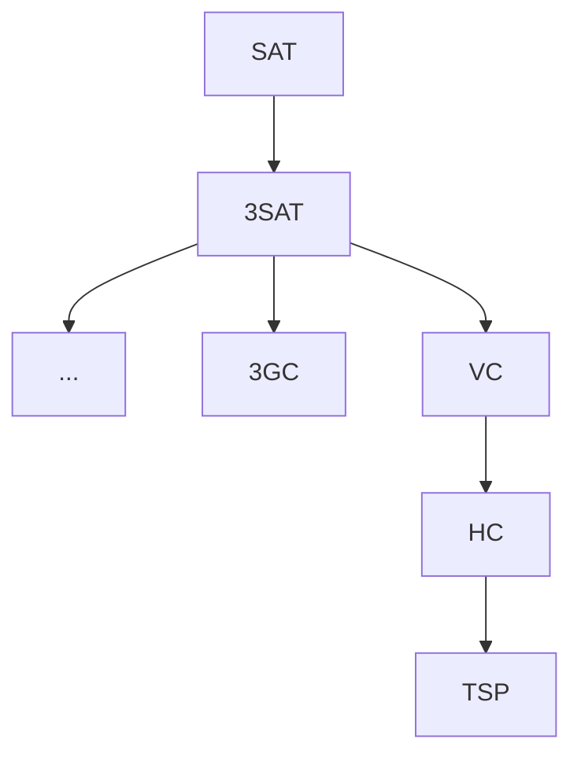

[[_Design and Analysis of Computer Algorithms]]


# 8.1 Introduction

Most of the algorithms studied so far have been *polynomial time* algorithms: on input size $n$, their worst case complexities are $O(n^k)$ for some constant $k$.


> [!NOTE] 
> The subject of this chapter is an important class of (practical) problems whose status is unknown: no polynomial-time algorithm has been discovered for any of them, and no superpolynomial-time lower bound has been proven for any of them.

Some examples are:
1. The Traveling-Salesman Problem (TSP)
   Given a set of $n$ cities and the cost of travelling between every two cities, find a tour which starts from a city, passing through every other city once, and return to that same city, so that the total cost is minimum.
2. Hamiltonian Cycle (HC)
   Given an undirected graph $G=(V,E)$, does there exist a cycle in $G$ which includes every vertex of $G$?
3. CNF-Satisfiability (SAT)
   A *literal* is a logical variable (or the complement of a logical variable). A clause is a sequence of literals separates by the boolean operator $\vee$. A logical expression in *conjunctive normal form* (CNF) is a sequence of clauses separates by the boolean and operator $\wedge$.
   
   Given a logical expression in CNF, does there exist a way of assigning true and false values to the logical variables in the expression so the value of the expression is true?
4. Graph Colouring (GC)
   Given an undirected graph $G=(V,E)$, determine $\chi(G)$ (i.e., the smallest number of colours needed to colour $G$ such that no two adjacent vertices are given the same colour).

Some of the above are optimization problems, while the others are decision problems.

> [!definition|*] Optimization problem
> An optimization problem is a problem that seeks for the best among many solutions, according to a sample cost criterion (e.g., TSP and GC).

> [!definition|*] Decision problem
> A **decision problem** is a problem whose solution is either *yes* or *no* (e.g., HC and SAT).


# 8.2 The class P


> [!NOTE]
> For every optimization problem, there corresponds a decision problem.

For example, the Travelling-Salesman Problem has a corresponding decision problem "does there exist a tour which starts from a city, passing through every other city once, and return to that same city, so that the total cost incurred is no more than $K$?".

In general we can make the cast by imposing a bound on the value to be optimized.


> [!NOTE]
> A solution to an optimization problem gives rise to a solution to the corresponding decision problem.

For example, suppose the TSP is solved. We are to compute the solution of the TS decision problem for some input. Let $C$ be the optimal solution for the TSP for that input. Compare $C$ with $K$.

If $C\leq K$, the solution to the TS decision problem is yes.
If $C>K$, then since $C$ is the optimal (smallest) solution, there is no better one that could be less than $K$. So the solution to the TS decision problem is no.

In general we have the following.

> [!lemma|8.1]
> Let $\Pi$ be an optimization problem which can be solved in polynomial time. Then its corresponding decision problem $\Pi_{D}$ can also be solved in polynomial time.

`\begin{proof}`
First use a polynomial-time algorithm of $\Pi$ to produce a solution to $\Pi$.

Next, compare the solution with the bound provided in the problem definition of the corresponding decision problem $\Pi_{D}$. The solution to $\Pi_{D}$ can be determined.

As the comparison clearly can be done in polynomial time, the lemma thus follows.
`\end{proof}`


> [!NOTE]
> Optimization problems are no easier to solve efficiently than there corresponding decision problems.

Therefore, without loss of generality, we may centre the theory of NP-completeness around decision problems. Thus we can make a definition.

> [!definition|*]
> The complexity class $\mathbf{P}$ is the set of all decision problems that are solvable in polynomial time.


# 8.3 Impact of input size

Every decision problem can be considered as a set of *problem instances* in which each problem instance is either a yes-instance or no-instance.

Given an algorithm that solves a given decision problem, the inputs to that algorithm are the problem instances of that problem. So, the problem instances must be encoded in a way which is acceptable to the algorithm. A question that naturally arises is:

>Does the membership of a problem of class $\mathbf{P}$ depend on the encoding method used in encoding problem instances?

Unfortunately the answer is yes. For instance, consider the problem below.

## Example (Primality testing)

> [!example|*] Primality testing
> Given a positive integer $n$, is $n$ a prime number?
> 

The following is an algorithm for Primality testing.

```python
Algorithm PrimalityTest
Input: an integer n
Output: yes iff n is a prime
begin
	found := false
	j := 2
	while not(found) and j < n do
		if n%j = 0 then
			found := true
		else
			j := j + 1
	return not(found)
end
```


### Encoding method for input

1. *unary numbering*: input size is $k=n$.
   Each iteration of the while loop takes $O(n)$ time because doing division with unary numbers takes $O(n)$ time. The while loop thus takes $O(n^2)$ time. The total time is thus $O(n^2) = O(k^2)$.
   Hence, Primality Testing belongs to $\mathbf{P}$.
2. *binary numbering*: input size is $k=\lg n$.
   Each iteration of the while loop takes $O(1)$ time. The while loop thus takes $O(n)$ time. The total time is thus $O(n)=O(2^{\lg n}) = O(2^k)$. Therefore, algorithm PrimalityTest takes exponential time, so we cannot claim that Primality Testing belongs to $\mathbf{P}$.

Hence, the membership of a decision problem of $\mathbf{P}$ depends on the encoding method used in representing its input.

We also can define "reasonable" encodings:
1. Numbers in binary form, or in number systems that are polynomially related to the binary system.
2. Characters represented by binary-codes (e.g., ASCII).
3. Representation of finite sets is polynomially related to its representation as a list of its elements enclosed within braces separates by commas.
4. Tuples, graphs, functions, etc. are represented as finite sets or collections of finite sets.


# 8.4 The class NP

Although many decision problems have no known polynomial time algorithm solving them, they do have polynomial time verification algorithms that *verifies* their yes-instances.

For example, on a Hamiltonian Cycle (HC), no polynomial time algorithm is known. However, HC does have a polynomial time verification algorithm.

Given a graph $G=(V,E)$ and a sequence of vertices $C$ which form a HC in $G$, the verification algorithm examines $C$ to make sure that:
- the first and last vertices in $C$ are identical
- every vertex of $G$ appears in $C$ exactly once (with the exception of the first and last)
- there is an edge connecting every two consecutive vertices in $C$

```python
Input: A graph G=(V,E) and a sequence of vertices C=v[1 ... |C|] in G
Output: Yes if C is a Hamiltonian cycle of G, otherwise "anything but yes" is returned, since we dont know if the algorithm can terminate
begin
1	V0 = V
2	if v[1] = v[|C|] and |V| + 1 = |C| then
		for i := 1 to |C| - 1 do
			if v[i] is in V0 and (v[i], v[i+1]) is in E then
				V0 = V0 - { v[i] }
			else
				break
		return 'yes'
end
```

Step 1 takes $O(1)$ time.
For step 2, the if statement in the for loop takes $O(|V| + |E|) = O(|V|^2)$ time. The entire step thus takes $O(|C| \times |V|^2) = O(|V|^3)$ time.
Thus the total time is $O(|V|^3)$ and HC has a polynomial-time verification algorithm.

> [!definition|*] Nondeterministic algorithm
> A **nondeterministic algorithm** for a decision problem $\Pi$ is an algorithm which operates in two phases:
> 1. (The (nondeterministic) guessing phase)
>    An arbitrary string of characters $s$, called a **guess**, is written at some designated place in memory.
> 2. (The verification phase)
>    A deterministic algorithm begins its execution with the input $\pi$ and the guess string $s$ (it may completely ignore $s$) and will (a) eventually halt and output "yes" if $\pi$ is a yes-instance, or (b) eventually halt and output "no" or never halt if $\pi$ is a no-instance.

> [!definition|*] Certificate
> A **certificate** is a guess which leads to a "yes" output.
> So, a certificate contains conclusive evidence to the effect that the given problem instance $\pi$ is a yes-instance if it is indeed a yes-instance.


Moreover, the nondeterministic algorithm has a "magical" insight so that whenever the given problem instance $\pi$ is a yes-instance, the guess $s$ written in phase 1 is always a certificate.

> [!definition|*]
> The **execution time of a nondeterministic algorithm** is the time it takes to write down the guess string $s$ plus the execution time of the verification phase, i.e.,
> $$ O(|s|) + \text{ execution time of verification phase } $$

> [!definition|*]
> The complexity class $\mathbf{NP}$ is the set of all decision problems which can be solved by nondeterministic algorithms in polynomial time.

Intuitively, $\mathbf{P}$ consists of problems that can be *solved* quickly, where $\mathbf{N}\mathbf{P}$ consists of problems that can be *verified* quickly.

## Example: TSP

> [!example|*]
> Show that TSP $\in \mathbf{N}\mathbf{P}$

Given algorithm:
```python
nondeterministic-Algorithm TSP
Input: 
	a set of n cities C = {1, 2, ..., n}
	a matrix c[1 ... n, 1 ... n], c[i,j] is the cost of travelling from city i to city j
	a positive real number K
Output: yes if there is a tour with total cost <= K (otherwise there is no specified output)
begin
	# guessing phase
	write down a sequence of cities t[1 ... |T|]
	
	# verification phase
	C0 := C
	cost := 0
	if t[1] = t[|T|] and |T| = n + 1 then
		for i := 1 to |T| - 1 do
			if t[i] is in C0 then
				C0 := C0 - { t[i] }
				cost := cost + c[t[i], t[i+1]]
			else
				break
	return 'yes' if cost <= K else 'no'
end
```

The algorithm takes $O(n^{2})$ time, thus TSP $\in \mathbf{N}\mathbf{P}$.

> [!lemma|8.2]
> $\mathbf{P} \subseteq \mathbf{N}\mathbf{P}$.

^a16836

`\begin{proof}`
Let $\Pi \in \mathbf{P}$. There exists a polynomial time algorithm $A$ which solves $\Pi$. Construct a nondeterministic algorithm $A'$ in which the guessing phase writes down the null string, and the verification phase ignores the guess string and uses $A$ as the verification algorithm to execute just on the given input $\pi$.

Then $\pi \in \Pi$ is a yes-instance $\iff A$ halts on input $\pi$ and prints a "yes" $\iff A'$ halts on input $\pi$ and prints a "yes".

In other words, $A'$ is a verification algorithm for $\Pi$. Since the guessing phase of $A'$ takes $O(1)$ time and the verification phase of $A'$ takes polynomial time, $A'$ thus takes polynomial time, i.e., $\Pi \in \mathbf{N}\mathbf{P}$. Hence, $\mathbf{P} \subseteq \mathbf{N}\mathbf{P}$.
`\end{proof}`


> [!remark|*]
> An open problem is, is it true that $\mathbf{P} = \mathbf{N}\mathbf{P}$? 
> Most researchers believe that $\mathbf{P} \neq \mathbf{N}\mathbf{P}$.


# 8.5 NP-Complete problems

First, we shall introduce a technique called *reduction*, which transforms one problem to another so that a solution to the latter provides a solution to the former.

Intuitively, the concept of reduction between decision problems can be explained as follows.

Let $\Pi_{1}$ be a problem we want to solve, and $\Pi_{2}$ be a problem for which we have an algorithm $A_{2}$.

Suppose we have an algorithm $T$ which takes a problem instance $\pi_{1} \in \Pi_{1}$ and produces a problem instance $T(\pi_{1}) \in \Pi_{2}$ such that:
$$
\pi_{1}\text{ is a yes-instance of } \Pi_{1} \iff T(\pi_{1})\text{ is a yes-instance of } \Pi_{2}
$$
Then, by composing $T$ and $A_{2}$, we obtain an algorithm $A_{1}$ for $\Pi_{1}$.

In the theory of $\mathbf{N}\mathbf{P}$-completeness, an additional requirement for $T$ is that is has to be efficient. We thus have the following definition.

> [!definition|*]
> Let $\Pi_{1},\Pi_{2}$ be two decision problems, and $T: \Pi_{1} \to \Pi_{2}$.
> $T$ is a **polynomial reduction** (or **polynomial transformation**) from $\Pi_{1}$ to $\Pi_{2}$ if:
> (i) $T$ can be computed in polynomial time
> (2) $\forall \pi_{1} \in \Pi_{1}$, $\pi_{1}$ is a yes-instance of $\Pi_{1} \iff T(\pi_{1})$ is a yes-instance of $\Pi_{2}$.
> 
> $\Pi_{1}$ is **polynomially reducible** to $\Pi_{2}$, denoted by $\Pi_{1} \propto \Pi_{2}$, if there exists a polynomial reduction from $\Pi_{1}$ to $\Pi_{2}$.

> [!example|*]
> Let $\Pi_{1}$ be: Given $n$ boolean values $v_{1},v_{2},\dots,v_{n}$, is at least one of the $v_{i}$'s true?

`\begin{proof}`
Let $\Pi_{2}$ be: Given $n$ integers $x_{1}, x_{2}, \dots, x_{n}$, is the maximum integer positive?
Define $T: \Pi_{1} \to \Pi_{2}$ such that $\forall(v_{1}, v_{2}, \dots, v_{n}) \in \Pi_{1}$, $T((v_{1},v_{2}, \dots, v_{n})) = (x_{1},x_{2}, \dots, x_{n})$ where
$$
x_{i} = \begin{cases}
1 & \text{ if } v_{i} \text{ is true } \\
0 & \text{ if } v_{i} \text{ is false }
\end{cases}
$$
$\pi_{1} \in \Pi_{1}$ is a yes-instance $\iff \exists v_{i}, v_{i}$ is true $\iff \exists x_{i}, x_{i} = 1 \iff T(\pi_{1}) \in \Pi_{2}$ is a yes-instance.

Moreover, the function $T$ can be easily computed in $O(n)$ time. Hence, $\Pi_{1} \propto \Pi_{2}$.
`\end{proof}`

> [!lemma|8.3]
> Let $\Pi_{1} \propto \Pi_{2}$. Then $\Pi_{2} \in \mathbf{P} \implies \Pi_{1} \in \mathbf{P}$.

^f6e54f

`\begin{proof}`
$\Pi_{1} \propto \Pi_{2}$ implies that there exists a polynomial reduction $\mathcal T$ from $\Pi_{1}$ to $\Pi_{2}$. Let $T$ be the polynomial-time algorithm computing $\mathcal{T}$.

$\Pi_{2} \in \mathbf{P}$ implies that there exists a polynomial time algorithm $A_{2}$ solving $\Pi_{2}$.

Consider the following algorithm $A_{1}$:
1. Execute algorithm $T$ on input $\pi_{1} \in \Pi_{1}$ to produce $\mathcal{T}(\pi_{1}) \in \Pi_{2}$
2. Execute algorithm $A_{2}$ on input $T(\pi_{1}) \in \Pi_{2}$ (the output of $A_{2}$ is the output of $A_{1}$).
   So $A_{1}$ outputs a yes on input $\pi_{1} \in \Pi_{1} \iff A_{2}$ outputs a yes on input $\mathcal{T}(\pi_{1}) \in \Pi_{2} \iff \mathcal{T}(\pi_{1})$ is a yes-instance $\iff \pi_{1}$ is a yes-instance.
Therefore, algorithm $A_{1}$ solves $\Pi_{1}$.

Now, suppose for any input of size $n$, algorithm $T$ takes $O(p(n))$ time, and algorithm $A_{2}$ takes $O(q(n))$ time, where both $p,q$ are polynomial functions.

Since writing each symbol of $\mathcal{T}(\pi_{1})$ takes $O(1)$ time, the length of $\mathcal{T}(\pi_{1})$ is bounded by the execution time of $T$. In other words
$$
|\mathcal{T}(\pi_{1})| = O(p(n))
$$
Algorithm $A_{1}$ thus takes $O(q(p(n))) = O((p \circ g)(n))$ time. As $p,q$ are polynomial functions, so is $p \circ q$. Hence, $\Pi_{1} \in \mathbf{P}$.
`\end{proof}`

The above Lemma can be equivalently stated as
$$
(\Pi_{1} \propto \Pi_{2} \implies \Pi_{1} \not\in \mathbf{P}) \implies \Pi_{2} \not\in \mathbf{P}
$$
Hence, $\Pi_{1} \propto \Pi_{2}$ can be interpreted as "$P_{2}$ is at least as hard to solve efficiently as $\Pi_{1}$".


> [!definition|*] NP-Complete
> A decision problem $\Pi$ is **NP-complete** if
> (i) $\Pi \in \mathbf{N}\mathbf{P}$
> (ii) $\forall \Pi' \in \mathbf{N}\mathbf{P}, \Pi' \propto \Pi$

Informally speaking, NP-complete problems are the hardest problem to solve efficiently in $\mathbf{N}\mathbf{P}$.

> [!theorem|8.4]
> Let $\Pi$ be any $\mathbf{N}\mathbf{P}$-complete problem. If $\Pi \in \mathbf{P}$, then $\mathbf{P} = \mathbf{N}\mathbf{P}$.

`\begin{proof}`
Let $\Pi' \in \mathbf{N}\mathbf{P}$.
Then, $\Pi$ is $\mathbf{N}\mathbf{P}$-complete $\implies \Pi'' \in \mathbf{N}\mathbf{P}, \Pi'' \propto \Pi \implies \Pi' \propto \Pi$.
But $\Pi \in \mathbf{P}$, therefore by [[#^f6e54f]], $\Pi' \in \mathbf{P}$, i.e., $\mathbf{N}\mathbf{P} \subseteq \mathbf{P}$.
But by [[#^a16836]], $\mathbf{P}\subseteq \mathbf{N}\mathbf{P}$. Hence, $\mathbf{P} = \mathbf{N}\mathbf{P}$.
`\end{proof}`


# 8.6 Proving NP-completeness

> [!definition|*] Truth assignment
> A **truth assignment** of a CNF logical expression is a function $t: U \to \{ \text{true}, \text{false} \}$, where $U$ is the set of variables in the expression. Let $u \in U$. If $t(u) =\text{true}$, then $u=\text{true}$ under $t$, and $\bar{u} =\text{false}$ under $t$. A CNF expression is **satisfiable** if there exists a truth assignment $t$ for the expression so that the value of the expression is true.

For example, the following is a satisfiable CNF logical expression
$$
(\bar{p} \vee q) \wedge (p \vee r) \wedge (q \vee \bar{r} \vee \bar{s})
$$
For the following assignment of truth values to the variables
$$
t(p) = \text{false}; \ \ \ t(q) = \text{true}; \ \ \ t(r) = \text{true}; \ \ \ t(s) = \text{true}
$$
So thus $(\bar{p} \vee q) \wedge (p \vee r) \wedge (q \vee \bar{r} \vee \bar{s}) = \cdots =\text{true}$.
Therefore, the expression is satisfiable.


> [!lemma|8.5]
> $\Pi_{1} \propto \Pi_{2} \wedge \Pi_{2} \propto \Pi_{3} \implies \Pi_{1} \propto \Pi_{3}$.

> [!corollary|8.5.1]
> Let $\Pi'$ be an $\mathbf{N}\mathbf{P}$-complete problem, and $\Pi \in \mathbf{N}\mathbf{P}$. Then
> $$ \Pi' \propto \Pi \implies \Pi\text{ is also } \mathbf{N}\mathbf{P}\text{-complete} $$

The above corollary leads us to the following method of proving $\mathbf{NP}$-completeness.

> [!remark|*]
> To prove that a decision problem $\Pi$ is $\mathbf{NP}$-complete, we may proceed as follows:
> 1. Prove that $\Pi \in \mathbf{NP}$
> 2. Select a known $\mathbf{NP}$-complete problem $\Pi'$
> 3. Show that $\Pi' \propto \Pi$


Note that we have only covered (so far) that the CNF Satisfiability problem (SAT) is the only known $\mathbf{NP}$-complete problem. Construction of the rest of the examples can begin from SAT. The follow diagram is the sequence of reductions we can use to prove the $\mathbf{NP}$-completeness of the respective problems




`\end{proof}`