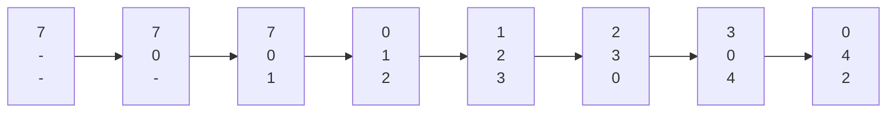

# Ch.1

## Definitions

> [!definition|*] Kernel
> The core of the OS that controls everything in the system (THE program of the OS).

> [!definition|*] Multicore System
> A multicore system is when multiple computing cores reside on a single chip. 
> 
> These can be more efficient than multiple chips with single cores, because on-chip communication is faster than between-chip communication.

> [!definition|*] Multiprogramming System
> A form of parallel processing where several programs run at the same time on one processor (system).


# Ch.2

## Definitions

> [!definition|*] OS Structure
> An OS structure is how an OS is organized. The common structures are:
> - Monolithic
> 	- No structure: all functionality is placed in a single, static binary file that runs in a single address space
> 	- Little overhead and fast communication
> 	- Difficult to implement/extend
> - Layered
> 	- OS is broken into multiple layers (levels)
> 	- Bottom layer (0) is hardware, highest is user interface
> 	- Simple to construct/debug
> 	- Poor performance
> - Microkernels
> 	- Removes all nonessential components from the kernel and implements them as user-level programs in separate address spaces (resulting in a smaller kernel)
> 	- Provides minimal process/memory management
> 	- Easy to extend/port
> 	- Poor performance
> - Modules
> 	- The kernel has a set of core components and can link additional services (via modules) either at boot or runtime
> 	- Idea is to provide core services while allowing other services to be implemented dynamically


# Ch.3

## Definitions

> [!definition|*] Process Control Block
> Each process is represented in an OS by a **process control block (PCB)**. It contains many pieces of information associated with a process, including
> - Process state (new, ready, running, waiting, halted, etc.)
> - Program counter (the address of the next instruction to-be-executed)
> - CPU registers
> - CPU-scheduling information
> - Memory-management information
> - Accounting information
> - I/O status information


# Ch.4

## Definitions

> [!definition|*] Multithreading Model
> A multithreading model is a way of establishing a relationship between user and kernel threads. The common models are
> - Many-to-one (many user threads to one kernel thread)
> - One-to-one (one user thread to one kernel thread)
> - Many-to-many (many user threads to many kernel threads)


# Ch.5

## Definitions (arrival time, etc.)

> [!definition|*] Burst time
> The total time taken by the process for its execution on the CPU.

> [!definition|*] Arrival time
> The time when a process enters into the ready state/is ready for its execution.

> [!definition|*] Completion time
> The time when a process completes its execution and exits the system.

> [!definition|*] Response time
> The interval a process spends in the ready queue and when it gets to the CPU for the first time.
> $$ RT = \text{time of first execution} - AT $$

> [!definition|*] Waiting time
> The total time a process is in the ready queue.
> $$ WT = TT - BT $$
> 

> [!definition|*] Turnaround time
> The interval of a process' submission to completion. 
> $$TT = CT - AT = BT + WT$$

> [!definition|*] Throughput
> The number of processes that are completed per unit of time.


## Scheduling algorithms

### FCFS

First-Come, First-Served Scheduling
- Simplest scheduling algorithm
- Whichever process requests the CPU first gets it first
- Managed with a queue
- Pros:
	- Simple
- Cons:
	- Average waiting time is often long

### SJF

Shortest-Job-First Scheduling
- Executes the process with the shortest-next-burst time
	- For ties, FCFS is used
- Can be preemptive or non-preemptive
	- A preemptive SJF will (upon arrival of a new process) preempt the currently-executing process, if its remaining time is longer than the new process' burst time
- Pros:
	- Minimum average waiting time
- Cons:
	- Potential for starvation or long turnaround times


### RR

Round-Robin Scheduling
- Similar to FCFS but with preemption
- Comes with a pre-defined **time quantum** $q$
- Scheduler limits processes to use burst times of $\leq q$
	- If a process exceeds $q$ it is preempted and put to the back of the ready queue
- Pros:
	- No possibility of starvation
- Cons:
	- Large $q \implies$ essentially becomes FCFS
	- Small $q \implies$ lots of context switches, low throughput


### Priority

Priority Scheduling
- A priority gets assigned to each process - the lowest # priorities go first
- SJF is a special case of this
- Can be preemptive or non-preemptive
- Pros:
	- The (defined) importance of a process decides which go first
- Cons:
	- Potential for starvation
		- Can be solved through **aging** (increasing priority of processes waiting for a long time)

### MFQ

Multilevel Queue Scheduling
- In practice it is often easier to have separate queues for each priority, where schedulers simply schedule processes in the highest-priority queue
- If there are multiple processes in the highest-priority queue, they are executed in RR order


# Ch.6 (Synchronization Tools)

## Definitions

> [!definition|*] Atomic Operation
> A type of operation that runs without interruption.

> [!definition|*] Race Condition
> A **race condition** occurs when a system attempts access/edit the same resource at the same time, leading to unexpected outcomes.

> [!definition|*] Memory Barrier
> A **memory barrier** is an instruction that forces any change in memory to be made visible to all other processes.

> [!definition|*] Mutex
> A **mutex** (mutually-exclusive flag) is a boolean variable indicating if a lock is available or not.

> [!definition|*] Spinlock
> A **spinlock** is a lock that causes a thread trying to acquire it to simply wait in a loop that repeatedly checks if the lock is available.

> [!definition|*] Semaphore
> A **semaphore** is a tool that provides more sophisticated ways for processes to synchronize their activities. A semaphore $S$ is an integer variable that locks while it is $\leq 0$ (via `wait()`).

> [!definition|*] Monitor
> A **monitor** is a thread-safe struct that wraps a mutex in order to safely allow access to a method/variable by more than one thread.

> [!definition|*] Deadlock
> A **deadlock** is two or more processes waiting indefinitely for an event that can be caused by only one of the waiting processes. There are other forms of deadlock as well, such as:
> - **Starvation**: a process may never be removed from the semaphore queue
> - **Priority Inversion**: scheduling problem when a lower-priority process holds a lock needed by a higher-priority process


# Ch.7 (Synchronization Examples)

## Definitions

## Bounded-Buffer Problem

In this problem, the producer and consumer processes look as follows

```c
int n;
semaphore mutex = 1;
semaphore empty = n;
semaphore full = 0;

void producer() {
	while (true) {
		// produce item
		wait(empty);
		wait(mutex);
		// add item to buffer
		signal(mutex);
		signal(full);
	}
}

void consumer() {
	while (true) {
		wait(full);
		wait(mutex);
		// remove item from buffer
		signal(mutex);
		signal(empty);
		// consume item
	}
}
```


## Readers-Writers Problem

Suppose a database is to be shared among several concurrent processes. Some processes may only want to read (readers), where others can update (read/write) (writers).

To minimize difficulties we require writers have exclusive access to the database while writing.

There are several variations to the readers-writers problem, such as
- the first readers-writers problem
	- requires that no reader should be kept waiting unless a writer has already obtained permission to use the shared object
	- in other words, no reader should wait for other readers to finish simply because a writer is writing
- the second readers-writers problem
	- requires that, once a writer is ready, that writer performs its write ASAP
	- in other words, if a writer is waiting to access the object, no new readers can start reading

A solution to either problem may result in starvation. In the first case the writer may starve, where in the second the readers may starve.

A solution to the first is

```c
semaphore rw_mutex = 1;
semaphore mutex = 1;
int read_count = 0;

void reader() {
	while (true) {
		wait(mutex);
		read_count++;
		if (read_count == 1) wait(rw_mutex);
		signal(mutex);
		// reading is performed
		wait(mutex);
		read_count--;
		if (read_count == 0) signal(rw_mutex);
		signal(mutex);
	}
}

void writer() {
	while(true) {
		wait(rw_mutex);
		// writing is performed
		signal(rw_mutex);
	}
}
```


## Dining Philosophers Problem

5 philosophers alternating between thinking and eating. They sit in a circular table where in the center is a bowl of rice. The table has five single chopsticks.

A philosopher can pick up one chopstick at a time. When a hungry philosopher has both chopsticks, they eat without releasing the chopstick. When done, they put the chopsticks down and starts thinking again. A philosopher needs both chopsticks to eat.

Solutions can be implemented with semaphores or monitors.

```c

void semaphore() {
	while (true) {
		wait(chopstick[i]);
		wait(chopsticl[(i+1)%5]);
		// eat
		signal(chopstick[i]);
		signal(chopstick[(i+1)%5]);
		// think
	}
}


struct DiningPhilosophers {
	State state[5];
	condition self[5];

	void pickup(int i) {
		state[i] = HUNGRY;
		test(i);
		if (state[i] != EATING) self[i].wait;
	}

	void putdown(int i) {
		state[i] = THINKING;
		test((i+4) % 5);
		test((i+1) % 5);
	}
}

```

# Ch.8 (Deadlocks)

## Definitions

> [!definition|*] Safe State
> A system is in a **safe state** if it can allocate resources to each thread in some order and still avoid a deadlock.


## Deadlock Characterization

A deadlock can arise if the following all hold at once:
- **Mutual exclusion** (one thread at a time can use a resource)
- **Hold and wait** (a thread holding at least one resource is waiting to acquire more resources held by other threads)
- **No preemption** (a resource can only be voluntarily released by the thread holding it, after it completes its task)
- **Circular wait** (there exists a set of waiting threads such that $T_{0}$ is waiting for a resource held by $T_{1}$, $T_{1}$ is waiting for $T_{2}$, ..., and $T_{n-1}$ is waiting for one held by $T_{0}$)

## Resource-Allocation Graph

- A directed edge $T_{i} \to R_{j}$ means thread $T_{i}$ has requested an instance of resource $R_{j}$
- A directed edge $R_{j} \to T_{i}$ means resource $R_{j}$ is being held by thread $T_{i}$
- If a RAG has a cycle, the system MAY be in a deadlocked state

## Deadlock Avoidance

### RAG Algorithm

If we have a resource-allocation system with only one instance of each resource type, we can use the following algorithm.

Suppose thread $T_i$ requests resource $R_{j}$.

We can grant the request iff converting $T_{i} \to R_{j}$ to an assignment edge $R_{j} \to T_{i}$ does not result in the formation of a cycle. If no cycle exists, the allocation of the resource will leave the system in a safe state. If a cycle is found, the system is put in an unsafe state.


### Banker's Algorithm

The RAG algorithm is not applicable to a resource-allocation system with multiple instances of each resource type. Banker's algorithm is applicable but is less efficient.

When a new thread enters the system, it must declare the maximum number of instances of each resource type it needs. When a user requests a set of resources, the system determines whether the allocation of the resources will leave the system in a safe state. If it will, allocate, otherwise wait until some other thread releases more resources.

Several data structures must be maintained to implement the banker's algorithm. Let $n$ be the number of threads in the system and $m$ be the number of resource types.
- `Available`: a vector of length $m$ indicating the number of available resources of each type.
	- `Available[j] == k` $\implies k$ instances of $R_{j}$ are available
- `Max`: an $n \times m$ matrix holding the maximum demand of each thread.
	- `Max[i][j] == k` $\implies T_{i}$ may request at most $k$ instances of $R_{j}$
- `Allocation`: an $n \times m$ matrix holding the number of resources of each type allocated to each thread.
	- `Allocation[i][j] == k` $\implies T_{i}$ is currently allocated $k$ instances of $R_{j}$
- `Need`: an $n \times m$ matrix indicating the remaining resource need of each thread.
	- `Need[i][j] == k` $\implies T_{i}$ may need $k$ more instances of $R_{j}$
	- `Need[i][j] = Max[i][j] - Allocation[i][j]`


### Safety Algorithm

1. Let `Work` and `Finish` be vectors of lengths $m,n$ respectively. Initialize `Work = Available` and `Finish = [false, false, ...]`.
2. Find an $i$ such that
   `Finish[i] == false` and `Need[i] <= Work`.
   If no $i$ exists, go to step 4.
3. `Work = Work + Allocation[i]` and `Finish[i] = true`. Go back to step 2.
4. If `Finish[i] == true` for every $i$, then system is in safe state.


## Deadlock Detection

### Detection Algorithm

1. Let `Work` and `Finish` be vectors of length $m,n$ respectively.
   `Work = Available` and
   `Finish[i] = Allocation[i] == 0`
2. Find $i$ such that
   `Finish[i] == false` and `Request[i] <= Work`.
   If no $i$, go to step 4.
3. `Work = Work + Allocation[i]` and `Finish[i] = true`. Go back to step 2.
4. If `Finish[i] == false` for some $i$, then the system is in deadlock state (`Finish[i] == false` $\implies T_{i}$ is deadlocked)

# Ch.9

## Definitions

> [!definition|*] Hole
> A **hole** is a block of available memory.

> [!definition|*] Fragmentation
> When a process is unloaded/loaded from memory resulting in inefficient allocation/usage. We have two types:
> - **External Fragmentation**: total memory space exists to satisfy a request, but is not contiguous
> - **Internal Fragmentation**: allocated memory may be slightly larger than the requested memory. This size difference is memory internal to a partition and is not being used.

> [!definition|*] Page
> To avoid external fragmentation and varying-sized memory chunks, physical memory is divided into fixed-sized blocks called frames. We divide logical memory into blocks of the same sizes - these are called **pages**.

> [!definition|*] Transition Look-Aside Buffer
> The **transition look-aside buffer (TLB)** is a fast-lookup hardware cache, typically storing address-space identifiers.

> [!definition|*] Hit Ratio
> The percentage of times that a page number is found in the TLB is called the **hit ratio**. For example, an 80% hit ratio means we find the desired page number in the TLB 80% of the time.

> [!definition|*] Effective Access Time
> **Effective access time (EAT)** is a weighted average for the time it takes to get a value from memory.
> 
> For example, given an 80% hit ratio and that 10ns are needed to access memory ($10*2=20$ if not found in TLB):
> $$ EAT = 0.80(10) + 0.20(20) = 12 \text{ns} $$

> [!definition|*] Backing Store
> A fast disk large enough to accommodate copies of all memory images for all users.


## Dynamic Storage Allocation Problem

How do we satisfy a request of size $n$ from a list of free holes?
- **First-fit**: allocate the *first* hole that is big enough
- **Best-fit**: allocate the *smallest* hole that is big enough
	- Requires searching the entire list (unless ordered by size)
	- Produces the smallest leftover hole
- **Worst-fit**: allocate the *largest* hole
	- Requires searching the entire list (unless ordered by size)
	- Produces the largest leftover hole


## Address Translation Scheme

Run a program of size $N$ pages, we need to find $N$ free frames. We set up a **page table** to translate logical and physical addresses.

The address generated by the CPU is divided into:
- **Page number** $p$: used as an index into a page table which contains the base address of each page in physical memory
- **Page offset** $d$: combined with the base address to define the physical memory address that is sent to the memory unit
- We get an address in decimal with $pN+d$


## Implementing Page Tables

Page tables are kept in main memory
- Page-table base register (`PTBR`) points to the page table
- Page-table length register (`PTLR`) indicates size of the page table

Memory structures for paging can get huge using straight-forward methods. One simple solution is to divide the page table into smaller units:
- Hierarchical paging
	- Break up the logical address space into multiple page tables (commonly two-level)
	- Page the page table
	- For example, logical address pages outer page table, which pages inner page table
- Hashed page tables
	- Virtual page number is hashed into a page table, which contains a chain of elements
	- Each element contains
		- Virtual page number
		- Value of mapped page frame
		- Pointer to next element
	- Virtual page numbers are compared in this chain, searching for a match
- Inverted page tables
	- Tracks physical pages (instead of keeping track of all possible logical pages)
	- One entry for each real page
		- One entry consists of the virtual address of the page with information of the process that owns the page
	- Decreases memory needed to store each page table, but increases time needed to search


> [!NOTE]
> We can calculate sizes/entries with
> $$ a=pN+d $$
> by simply rearranging and omitting the $+d$ term. For example:
> $$ \begin{align} \text{256 pages, 4KB page size} &\implies a=256 \times 4 \text{KB} = 2^8 \times 2^{12} \text{ bits} \implies 8+12=20 \text{ bits}  \\
 \text{32 bit logical address, 4KB page size} &\implies p=2^{32} / 2^{12} = 2^{20} \text{ entries} \end{align} $$
 On something like an inverted page table, we only have one entry for each page, so
 $$ \begin{align} \text{256 pages, phys. mem. 64 frames} &\implies a=64 \times 4 \text{KB} = 2^6 \times 2^{12} \text{ bits} \implies 6+12=18 \text{ bits} \\ \text{max. 512MB phys. mem., 4KB page size} &\implies p=512 \text{MB} / 4 \text{KB} =  128 \text{K} \text{ entries} \end{align} $$


 

  


## Swapping

A process can be **swapped** temporarily out of memory to a **backing store** and then brought back into memory for continued execution (e.g., if processes use too much storage).

The swapped out process does not need to swap back into the same physical address. Modern OS use a modified version of standard swapping, where swaps only happen when free memory is extremely low.


# Ch.10 (Virtual Memory)

## Definitions

> [!definition|*] Virtual Memory
> **Virtual memory** is the separation of user logical memory from physical memory. Only a part of the program needs to be in memory for execution - so logical address space can be much larger than the physical address space. This allows for
> - address spaces to be shared by several processes
> - more efficient process creation
> - more programs to run concurrently
> - less I/O to load/swap processes

> [!definition|*] Virtual Address Space
> The **virtual address space** of a process refers to the logical/virtual view of how a process is stored in memory.

> [!definition|*] Global Replacement
> When a process is allowed to select a replacement frame from the set of all frames, even if it is allocated to some other process.

> [!definition|*] Local Replacement
> When a process is allowed to select a frame from only its own set of allocated frames.

> [!definition|*] Thrashing
> When a process is spending more time paging than executing, it is **thrashing**.


## Demand Paging

Loading pages (so that an entire program is not loaded into memory) as they are needed is called **demand paging** and is commonly used in virtual memory systems.
- When a process is executed with no pages in memory this is called **pure demand paging**

We need some form of hardware support to distinguish between pages in memory and in secondary storage - this is done with **valid-invalid bits**.

![[Screenshot 2025-04-15 at 1.52.04 PM.png|400]]

> [!NOTE]
> When a bit is set to valid, the page is both legal and in memory

Trying to access a page marked invalid causes a **page fault**. It is handled by "trapping" the OS, bringing the invalid page into memory, and then restarting the request - the page will now be able to be accessed as if it was always in memory.
- Most OS maintain a **free-frame list** (a pool of free frames) to handle page faults.

Demand paging involves three major activities:
- Servicing the interrupt
- Reading the page
- Restarting the process

We define a **page fault rate** $p \in [0,1]$ which is the likelihood of a page fault occurring. Thus we can calculate the effective access time:
$$
\begin{align}
EAT = (1&-p) \times \text{memory access}  \\
&+ p \times (\text{page fault overhead} + \text{swapping page out} + \text{swapping page in})
\end{align}
$$
> [!example|*]
> Given memory access time of 200ns, average page-fault service time of 8ms, calculate the $EAT$ if one access of 1000 cause page faults.
> $$ \begin{align} EAT &= (1-p) \times 200 + p(8 \times 10^6) \\ &= 8199.8 \text{ns} \end{align}$$


## Copy-on-Write

The technique **copy-on-write** involves allowing the parent and child to initially share the same pages. If either process writes to one, the page gets copied.


## Page Replacement

What happens if we have no free frames? We can find a page in memory that isn't being used (perhaps as much as others) and page it out.

### Basic Page Replacement

If no frame is free, find one not being used and free it. Use that page to hold the page which the process faulted. We select the frame to be swapped out (called the **victim frame**) using a page replacement algorithm.


## Page Replacement Algorithms

### FIFO

This algorithm associates each page with the time the page was brought into memory.
- The actual time is not required - just use a queue where pages brought into memory get inserted at the tail
- FIFO is easy to understand and program, but the performance isn't always good. 

For example consider the reference string:
$$
7,0,1,2,0,3,0,4,2
$$

if we can only load 3 pages in memory at a time per process, then we have



Notice that sometimes, adding more frames results in more page faults. This is called **Belady's anomaly**.

### Optimal

The optimal algorithm is one that has the lowest page-fault rate of all algorithms. It is simply defined as:
$$
\text{Replace the page that will not be used for the longest period of time}
$$

Unfortunately it is hard to implement, since it requires future knowledge of the reference string. It is mainly used for comparison studies.


### LRU

We can approximate OPT by replacing the page that has not been used for the longest period of time, called the **least recently used (LRU)** algorithm. It is used often and is considered to be good - the major problem is *how* to implement LRU replacement. Two versions are feasible:
- **Counters**. We associate each page-table entry a time-of-use field and add a counter to the CPU. The counter is incremented for every memory reference. 
  When we need to change a page, use the page with the smallest counter.
- **Stack**. Initialize a stack of page numbers. When a page is referenced, remove it from the stack and put it at the top.
	- Since entries are removed from the middle, this is best done with a doubly linked list.

Reference bits can be used to determine which pages are visited, and using more than one can determine ordering of pages.

#### Second-Chance Algorithm

Second-Change is FIFO, but inspect the reference bit:
- If 0, replace this page
- If 1, clear the bit and give the page a second chance, move to the next FIFO page
- Can be implemented with a circular queue

#### Enhanced Second-Chance Algorithm

Now consider the reference and modify bit as an ordered pair. Four cases arise:
- $(0,0)$: neither recently used nor modified - best page to replace
- $(0,1)$: not recently used but modified - not quite as good, because page needs to be written out before replacement
- $(1,0)$: recently used but clean - probably will be used again soon
- $(1,1)$: recently used and modified - probably will be used again soon, and will need to be written out before replacement

Replace the first page encountered in the lowest nonempty class.


## Allocation of Frames

How do we allocate the fixed amount of free memory among the various processes?

The minimum number of frames per process is defined by architecture, and the maximum is defined by the amount of available physical memory. There is a lot of choice in between these values.

### Allocation Algorithms

- **Equal allocation**
	- Split $m$ frames among $n$ processes by giving everyone an equal share of $m/n$ frames.
	- The remainder frames can be used as a free-frame buffer pool
- **Proportional allocation**
	- Allocate frames according to the size of a process
	- Let
		- $s_{i}$ be the size of a process $p_{i}$
		- $S = \sum s_{i}$
		- $m$ be the total number of frames
		- $a_{i} =m \times s_{i} / S$ be the amount of frames to allocate to $p_{i}$


## Thrashing

If a process does not have the minimum number of frames it needs, the page-fault rate gets very high, resulting in lots of paging. This high paging activity is called **thrashing**. We can limit effects by using local or priority page replacement.

### Working-Set Model

Let $\Delta$ be the working-set window (i.e., a fixed number of page references).

Let $WSS_{i}$ be the working-set of process $P_{i}$, defined as the total number of pages referenced in the most recent $\Delta$.
- $\Delta \to 0 \implies$ will not encompass entire locality
- $\Delta \to \infty \implies$ will encompass entire program

Then $D = \sum WSS_{i}$ is the total demand frames. If $D>m$ then we have thrashing.


## Allocating Kernel Memory

Two strategies for managing free memory that is assigned to kernel processes.

### Buddy System

Allocates memory from a fixed-size segment consisting of physically contiguous pages. It satisfies requests in units sized as a power of 2, if needed the request size is rounded up to one.

For example, if a memory segment is initially 256KB and the kernel requests 21KB of memory:
- Segment divided into two buddies $A_{L}, A_{R}$, each 128KB in size
- One of these are divided into $B_{L},B_{R}$, each 64KB in size
- One of these are divided into $C_{L}, C_{R}$, each 32KB in size
- One of $C_{L},C_{R}$ are used to satisfy the request of 21KB

An advantage is how quickly adjacent buddies can be combined to form larger segments by coalescing. For example, when $C_{L}$ is released it can combine its buddies back into the original 256KB segment.

An obvious disadvantage is the potential of fragmentation due to rounding up to powers of 2.

### Slab Allocation

A slab is made up of one or more physically contiguous pages. A cache consists of one or more slabs. 
- Use one cache for each kernel data structure
- On cache initialization, fill with objects marked as `free`
- On storing structures, mark objects as `used`
- If slab is full of `used` objects, next object is allocated from an empty slab

Now there is no chance of fragmentation and fast memory request satisfaction.


## Other Considerations

We should also make other considerations when making a paging system.

- **Prepaging**
	- Reduces the number of page faults at startup
	- Prepare some/all pages a process will need before they are references
- **Page Size**
	- OS designers have a choice of page sizes (powers of 2)
- **TLB Reach**
	- The amount of memory accessible from the TLB
	- Defined as $(\text{TLB Size}) \times (\text{Page Size})$
	- Provide multiple page sizes in this case
- **Memory Compression**
	- An alternative to paging
	- Rather than paging out multiple frames to save space, compress several frames into one


# Ch.11 (Mass-Storage Systems)

## Definitions

> [!definition|*] Transfer Rate
> **Transfer rate** is the rate at which data flows between the drive and computer.

> [!definition|*] Position Time
> **Position time (random-access time)** is the time to move the disk arm to the desired cylinder (seek time) and the time for a desired sector to rate under the disk head (rotational latency).

> [!definition|*] Disk Bandwidth
> Disk bandwidth is defined as
> $$ \frac{\text{total number of bytes transferred}}{\text{time between request and completion}} $$


## HDD Scheduling

The OS is responsible for using hardware efficiently. For disk drives, this means having fast access time and disk bandwidth.

When a process needs I/O to or from the drive, the system call to the OS consists of
- If the operation is input or output
- The open file handle to indicate the file to operate on
- What the memory address for the transfer is
- The amount of data to transfer

Several algorithms are used for disk-scheduling:

- **FCFS**
	- Simplest scheduling algorithm
	- Does not provide fast service, for example (98, 143, 37, 120) has a suboptimal swing from 143 to 37 to 120 - both 120 and 143 would be better services together
- **SCAN**
	- The disk arm starts at one end and moves toward the other, servicing requests as it reaches each cylinder until it hits the end of the disk. Then the head movement is reversed and servicing continues
- **C-SCAN**
	- A more uniform wait time opposed to SCAN
	- Head goes from one end of disk to other, servicing requests as it goes. However when it reaches the end, it goes right back to the beginning.

For example consider the queue of services $(98,183,37,122,14,124,65,67)$ with the head starting at $53$:
- FCFS: $$ 53,98,183,37,122,14,124,65,67 $$
- SCAN: $$ 53,37,14,65,67,98,122,124,183 $$
- C-SCAN: $$ 53,65,67,98,122,124,183,14,37 $$
How do OS designers decide which to use?
- SCAN and C-SCAN works well on systems with heavy load on disk
- Linux uses a deadline scheduler
	- Separate read/write queues
	- Four queues: 2 read and 2 write

